# Database Schema

> **Status:** Implemented foundation, marketplace/order schema, Product Q&A, Buyer Product Reviews, Seller-to-Logistics pickup scheduling, shared waybills, first-mile pickup confirmation, and final-mile fulfillment flow
>
> **Last synchronized:** 2026-09-20 (Buyer Product Reviews and Ratings MVP)
>
> **Database:** MySQL 8.0+
>
> **Source of truth:** `app/database/migrations/`

This document describes the schema that is currently implemented in `resources/js/api`. It is not a target-state schema for every marketplace feature in `Documentation/requirements.md`. Tables that are still deferred are listed separately so planned entities are not mistaken for deployed database objects.

## 1. Scope and role boundary

The implemented authentication schema follows the repository-level `AGENTS.md` contract and supports five roles:

- `buyer` — called Buyer in some product documents.
- `seller` — owns at most one shop.
- `admin` — reviews registrations and may receive custom permissions.
- `logistics` — operates one organization and its sole operational hub through the Admin dispatch dashboard.
- `courier` — consumes API endpoints from an external mobile application.

The current authentication and Logistics foundation includes:

- `logistics` in `users.role` and `registration_applications.application_type`;
- one `logistics_profiles` row per Logistics user;
- one `logistics_organizations` row per Logistics user;
- one `logistics_hubs` row per LuboSmart dispatch operation, with a unique organization foreign key; and
- one `courier_logistics_affiliations` row per Courier, linking it to the selected organization and derived sole hub.

Admin approves Logistics registration applications. The associated LuboSmart dispatch operation approves or rejects its Courier affiliations. Admin account lifecycle actions such as suspension, restoration, and deactivation remain separate from Courier affiliation approval.

The MVP uses exactly one operational hub/sorting center per LuboSmart dispatch operation. Registration creates the hub from the Logistics operational-hub address, and the unique organization foreign key prevents a second hub. Sub-hubs, additional hubs, and multi-hub operations are out of scope. Seller pickup requests, immutable shared waybills, schedules, first-mile assignment/acceptance/pickup-confirmation records, shared Parcel/Shipment records, hub milestones, independent final-mile offers, Courier hub-handoff evidence, private photo POD, and Logistics-confirmed delivery are implemented through additive migrations and the shared fulfillment transition service.

### Implemented Logistics cardinality and deferred operations

- A LuboSmart dispatch operation has exactly one operational hub/sorting center.
- A hub belongs to one LuboSmart dispatch operation, and the unique organization foreign key prevents a second hub or sub-hub in the MVP.
- The Logistics registration address is the organization's sole operational hub/sorting-center address. The authorized Admin dispatch account operates that hub through the Admin dispatch dashboard; no separate hub or sub-hub address is collected.
- Courier registration selects the LuboSmart dispatch operation; the sole hub is derived server-side rather than supplied as a client-controlled ID.
- Current foundation cardinality is one Logistics user per organization. Staff/sub-account support is a later authorization decision and is not part of this foundation.
- Implemented pickup requests, waybills, schedules, first-mile tasks, shared Shipment/Parcel records, hub milestones, final-mile offers and batch acceptance, hub-pickup QR evidence, photo POD, failed-attempt retry, delivery completion, and Courier vehicle-management APIs resolve through the organization's sole hub. Deferred advanced fleet extensions (maintenance, vehicle history, and capacity matching), zone, capacity, subscription, live Courier location telemetry, signature proof, returns, and exceptional recovery records must preserve that scope when introduced.

## 2. Database conventions

| Concern                  | Implemented convention                                                                                                                            |
| ------------------------ | ------------------------------------------------------------------------------------------------------------------------------------------------- |
| Application primary keys | MySQL `UUID`, generated as UUIDv7 by Eloquent's `HasUuids` trait                                                                             |
| Application foreign keys | `UUID` via Laravel `foreignUuid`                                                                                                                  |
| Sanctum tokens           | UUID primary key and UUID polymorphic owner key                                                                                                   |
| Enum-like values         | MySQL `VARCHAR`; strict values are PHP backed enums cast by Eloquent                                                                         |
| Timestamps               | Laravel `created_at` and `updated_at` columns unless noted otherwise                                                                              |
| File storage             | Database stores disk/path and metadata only; file bytes belong in configured blob storage                                                         |
| User deletion            | Owned profile data generally cascades; reviewer/grantor references become `NULL`; a shop restricts seller deletion                                |
| Seller tenancy           | A shop is linked directly to one seller user through `shops.seller_id`; seller-owned queries must derive tenant scope from the authenticated user |

Framework infrastructure tables retain the key types required by Laravel:

- `password_reset_tokens`, `sessions`, `cache`, `cache_locks`, and `job_batches` use natural/string keys.
- `jobs`, `failed_jobs`, and the migration repository use Laravel's numeric internal keys.
- These framework-only exceptions do not represent application-domain entities.

## 3. Implemented relationship map

```mermaid
erDiagram
    USERS ||--o| CUSTOMER_PROFILES : has
    USERS ||--o| SELLER_PROFILES : has
    USERS ||--o| COURIER_PROFILES : has
    USERS ||--o| ADMIN_PROFILES : has
    USERS ||--o| LOGISTICS_PROFILES : has
    USERS ||--o| LOGISTICS_ORGANIZATIONS : operates
    LOGISTICS_ORGANIZATIONS ||--|| LOGISTICS_HUBS : owns_sole
    ADDRESSES ||--o| LOGISTICS_HUBS : locates
    LOGISTICS_ORGANIZATIONS ||--o{ COURIER_LOGISTICS_AFFILIATIONS : approves
    LOGISTICS_HUBS ||--o{ COURIER_LOGISTICS_AFFILIATIONS : scopes
    USERS ||--o| COURIER_LOGISTICS_AFFILIATIONS : joins

    USERS ||--o{ REGISTRATION_APPLICATIONS : submits
    USERS o|--o{ REGISTRATION_APPLICATIONS : reviews
    USERS ||--o{ DOCUMENTS : owns
    USERS o|--o{ DOCUMENTS : reviews
    REGISTRATION_APPLICATIONS o|--o{ DOCUMENTS : contains
    USERS ||--o{ ADDRESSES : owns
    USERS ||--o{ CHECKOUT_QUOTES : requests
    USERS ||--o{ CHECKOUT_BATCHES : places
    USERS ||--o{ ORDERS : purchases

    USERS ||--o{ ADMIN_PERMISSIONS : receives
    USERS o|--o{ ADMIN_PERMISSIONS : grants
    PERMISSIONS ||--o{ ADMIN_PERMISSIONS : defines
    USERS o|--o{ AUDIT_LOGS : historically_attributed_to
    USERS o|--o{ AUDIT_OUTBOX : performs
    USERS ||--o{ NOTIFICATIONS : receives
    USERS ||--o{ ACCOUNT_LIFECYCLE_EVENTS : undergoes
    USERS ||--o{ ACCOUNT_LIFECYCLE_EVENTS : administers

    USERS ||--o| SHOPS : owns_as_seller
    SHOP_CATEGORIES o|--o{ SHOPS : classifies
    CATEGORIES o|--o{ CATEGORIES : parent_of
    SHOPS ||--o{ PRODUCTS : sells
    CATEGORIES o|--o{ PRODUCTS : classifies
    PRODUCTS ||--o{ PRODUCT_OPTION_GROUPS : configures
    PRODUCT_OPTION_GROUPS ||--o{ PRODUCT_OPTION_VALUES : contains
    PRODUCTS ||--o{ PRODUCT_VARIANTS : offers
    PRODUCT_VARIANTS }o--o{ PRODUCT_OPTION_VALUES : selects
    PRODUCTS ||--o{ PRODUCT_MEDIA : has
    PRODUCT_VARIANTS o|--o{ PRODUCT_MEDIA : has
    PRODUCT_VARIANTS o|--o| PRODUCT_MEDIA : primary_media
    PRODUCTS ||--o{ PRODUCT_QAS : receives
    USERS ||--o{ PRODUCT_QAS : asks
    USERS o|--o{ PRODUCT_QAS : answers_as_seller
    PRODUCTS ||--o{ PRODUCT_REVIEWS : receives
    USERS ||--o{ PRODUCT_REVIEWS : writes
    ORDERS ||--o{ PRODUCT_REVIEWS : verifies
    ORDER_ITEMS ||--o| PRODUCT_REVIEWS : permits_one
    PRODUCT_REVIEWS ||--o{ PRODUCT_REVIEW_IMAGES : includes
    FLASH_DEALS }o--o{ PRODUCTS : includes
    USERS ||--o{ RECENTLY_VIEWED_PRODUCTS : views
    PRODUCTS ||--o{ RECENTLY_VIEWED_PRODUCTS : appears_in
    CHECKOUT_QUOTES ||--o| CHECKOUT_BATCHES : produces
    CHECKOUT_BATCHES ||--o{ ORDERS : groups
    SHOPS ||--o{ ORDERS : owns
    SHOPS o|--o{ VOUCHERS : issues
    USERS ||--o{ VOUCHER_REDEMPTIONS : redeems
    ORDERS ||--o{ ORDER_ITEMS : snapshots
    ORDERS ||--o{ ORDER_ADDRESSES : versions_delivery_to
    ORDERS ||--o{ ORDER_STATUS_EVENTS : records
    ORDERS ||--o| CUSTOMER_ORDER_CANCELLATIONS : cancellation
    ORDERS ||--o{ CUSTOMER_ORDER_MODIFICATIONS : address_changes
    CUSTOMER_ORDER_MODIFICATIONS }o--|| ORDER_ADDRESSES : supersedes
    VOUCHERS ||--o{ ORDER_VOUCHERS : snapshots
    VOUCHERS ||--o{ VOUCHER_REDEMPTIONS : consumes
    ORDERS ||--o{ ORDER_VOUCHERS : applies
    ORDERS ||--o{ VOUCHER_REDEMPTIONS : redeems

    COURIER_PROFILES ||--o{ VEHICLES : registers
    ORDERS ||--|| PARCELS : contains
    WAYBILLS ||--|| PARCELS : identifies
    PARCELS ||--|| SHIPMENTS : moves
    SHIPMENTS ||--o{ DELIVERY_TASKS : has
    DELIVERY_TASKS ||--o{ DELIVERY_TASK_OFFERS : offered_as
    DELIVERY_TASKS ||--o{ SHIPMENT_EVIDENCE : records
    DELIVERY_TASKS ||--o{ COMPLETION_INTENTS : completes
    SHIPMENTS ||--o{ SHIPMENT_EVENTS : records

    USERS o|--o{ SESSIONS : opens
    USERS ||--o{ PERSONAL_ACCESS_TOKENS : authenticates_with
```



The `PERSONAL_ACCESS_TOKENS` relationship is polymorphic rather than a database foreign key. The current authentication model uses `User` as its token owner.

## 4. Enum values

Every column in this section is stored as a string in MySQL and cast to the listed PHP enum in its Eloquent model.

| PHP enum | Values | Used by |
| --- | --- | --- |
| `UserRole` | `buyer`, `seller`, `admin`, `logistics`, `courier` | `users.role`, `registration_applications.application_type`, `password_reset_tokens.role` |
| `UserStatus` | `pending`, `active`, `rejected`, `suspended`, `deactivated` | `users.status` |
| `AccountLifecycleAction` | `suspended`, `restored`, `deactivated` | `account_lifecycle_events.action` |
| `UserSex` | `male`, `female`, `non_binary`, `prefer_not_to_say` | Role-profile `sex` columns |
| `ApplicationStatus` | `pending`, `approved`, `rejected` | `registration_applications.status` |
| `DocumentType` | `government_id`, `business_registration`, `tax_document`, `drivers_license`, `vehicle_registration`, `official_receipt`, `certificate_of_registration`, `proof_of_address`, `other` | `documents.type` |
| `DocumentStatus` | `pending`, `verified`, `rejected` | `documents.status` |
| `AddressType` | `shipping`, `billing`, `both` | `addresses.type` |
| `VehicleType` | `motorcycle`, `car`, `van` | `vehicles.type` |
| `VehicleStatus` | `active`, `inactive`, `maintenance` | `vehicles.status` |
| `CourierAffiliationStatus` | `pending`, `approved`, `rejected`, `revoked` | `courier_logistics_affiliations.status` |
| `ShopStatus` | `pending`, `active`, `suspended`, `deactivated` | `shops.status` |
| `CategoryStatus` | `active`, `archived` | `shop_categories.status`, `categories.status` |
| `ProductStatus` | `draft`, `active`, `archived` | `products.status` |
| `ProductVariantStatus` | `active`, `inactive` | `product_variants.status` |
| `CheckoutMode` | `cart`, `buy_now` | Checkout request validation and `checkout_quotes.input_payload` |
| `PaymentMethod` | `cod` | `orders.payment_method`, optional `vouchers.payment_method` |
| `PaymentStatus` | `pending` | `orders.payment_status` |
| `OrderStatus` | `pending_payment`, `placed`, `seller_processing`, `ready_for_pickup`, `assigned`, `picked_up`, `in_transit`, `out_for_delivery`, `delivered`, `cancelled`, `rejected`, `delivery_failed`, `return_requested`, `returned` | `orders.status`, `order_status_events.from_status`/`to_status`; current COD placement skips `pending_payment` |
| `VoucherIssuerType` | `app`, `shop` | `vouchers.issuer_type`, `order_vouchers.issuer_type` |
| `VoucherBenefitType` | `discount`, `shipping` | `vouchers.benefit_type`, `order_vouchers.benefit_type` |
| `VoucherValueType` | `fixed`, `percent` | `vouchers.value_type` |
| `AnnouncementStatus` | `draft`, `published`, `archived` | `announcements.status` |
| `PlatformPolicyType` | `terms_of_service`, `privacy_policy`, `internal_rules` | `platform_policies.type` |
| `PlatformPolicyVersionStatus` | `draft`, `published`, `superseded` | `platform_policy_versions.status` |
| `SellerComplianceCaseStatus` | `open`, `confirmed`, `dismissed`, `closed` | `seller_compliance_cases.status` |
| `SellerComplianceActionType` | `case_dismissed`, `case_closed`, `warning_issued`, `product_restricted`, `product_restriction_revoked`, `seller_suspension_referred` | `seller_compliance_actions.action` |
| `HomepageCampaignPlacement` | `hero`, `hero_side` | `homepage_campaigns.placement` |
| `HomepageAdvertisementLayout` | `single`, `carousel`, `multi_block`, `multi_block_carousel` | `homepage_advertisement_configurations.layout` |
| `HomepageAdvertisementStatus` | `draft`, `published`, `archived` | `homepage_advertisement_configurations.status` |
| `AdminAuditAction` | Registration, Admin authentication/account, Platform Settings, and user-account lifecycle action strings defined by the PHP enum | `audit_logs.action`, `audit_outbox.action` |
| `AuditSourceFeature` | `account_approval`, `admin_authentication`, `admin_account_management`, `platform_settings`, `user_account_management`, `seller_compliance` | `audit_logs.source_feature`, `audit_outbox.source_feature` |
| `ShipmentStatus` | `awaiting_seller_pickup`, `seller_pickup_assigned`, `seller_pickup_accepted`, `picked_up_from_seller`, `received_at_hub`, `sorted_at_hub`, `dispatched_from_hub`, `delivery_assigned`, `delivery_accepted`, `picked_up_from_hub`, `in_transit`, `out_for_delivery`, `delivered` | `shipments.status` |
| `FulfillmentTaskLeg` | `first_mile`, `final_mile` | `delivery_tasks.leg` |
| `FulfillmentTaskStatus` | `awaiting_seller_pickup`, `seller_pickup_assigned`, `seller_pickup_accepted`, `picked_up_from_seller`, `delivery_assigned`, `delivery_accepted`, `picked_up_from_hub`, `in_transit`, `out_for_delivery`, `delivered`, `rejected` | `delivery_tasks.status` |
| `DispatchScheduleStatus` | `scheduled` | `dispatch_schedules.status` |
| `FulfillmentOfferStatus` | `offered`, `accepted`, `rejected` | `delivery_task_offers.status` |
| `ShipmentEvidenceStatus` | `submitted`, `awaiting_validation`, `validated`, `rejected`, `unavailable` | `shipment_evidence.status`, `completion_intents.status` |
| `ShipmentEvidencePurpose` | `hub_pickup`, `delivery_proof` | `shipment_evidence.purpose` |

The database does not currently add `CHECK` constraints for these values. Request validation, model enum casts, and service-layer transition rules are responsible for rejecting invalid values. Audit-log reads intentionally tolerate action and feature strings that are unknown to the current application so historical events remain renderable after taxonomy changes.

### Shipment/Delivery Task status vocabulary

The additive fulfillment migration stores detailed physical state in `shipments` and `delivery_tasks`, separate from `orders.status`. Values use explicit lowercase `snake_case` names and are cast to PHP enums. They must not be added to `orders.status` by an individual feature.

```text
awaiting_seller_pickup
seller_pickup_assigned
seller_pickup_accepted
picked_up_from_seller
received_at_hub
sorted_at_hub
dispatched_from_hub
delivery_assigned
delivery_accepted
picked_up_from_hub
in_transit
out_for_delivery
delivered
```

Task-level `rejected` records an offered Courier's refusal and allows the same task to be offered to another eligible Courier without changing the Order. `stale` is an informational freshness condition for an unfinished task; it is not an `orders.status` value and should be derived unless a future task migration explicitly persists it. Neither condition automatically cancels an Order or reassigns a task.

`picked_up_from_seller` records the first-mile Seller handoff. `picked_up_from_hub` records the final-mile handoff from the Logistics hub. `waybill_created` and access/resolve records remain document/audit operations; deployed Shipment events record validated sort and dispatch milestones through the shared transition service.

## 5. Identity and authentication

### 5.1 `users`

**Model:** `App\Models\User`

All authenticating people share this table. Role-specific personal data lives in a separate profile table.

| Column              | MySQL type | Nullable | Default         | Notes                                          |
| ------------------- | --------------- | -------- | --------------- | ---------------------------------------------- |
| `id`                | UUID            | No       | Eloquent UUIDv7 | Primary key                                    |
| `email`             | VARCHAR         | No       | —               | Login identifier within a role                 |
| `email_verified_at` | TIMESTAMP       | Yes      | `NULL`          | Email verification time                        |
| `password`          | VARCHAR         | No       | —               | Hashed by the Eloquent cast                    |
| `role`              | VARCHAR         | No       | `buyer`      | Cast to `UserRole`                             |
| `status`            | VARCHAR         | No       | `pending`       | Cast to `UserStatus`; used for approval gating |
| `remember_token`    | VARCHAR(100)    | Yes      | `NULL`          | Laravel remember token                         |
| `created_at`        | TIMESTAMP       | Yes      | `NULL`          | Managed by Eloquent                            |
| `updated_at`        | TIMESTAMP       | Yes      | `NULL`          | Managed by Eloquent                            |

Constraints and indexes:

- Primary key: `id`.
- Unique: (`email`, `role`). The same email can be reused for different roles.
- Index: (`role`, `status`) for role-specific approval and account queues.

Model relationships:

- Zero or one `BuyerProfile`, `SellerProfile`, `CourierProfile`, `AdminProfile`, and `LogisticsProfile` row.
- Many addresses, registration applications, and documents.
- Zero or one seller-owned shop.
- Zero or one Logistics-owned organization and its sole hub.
- Zero or one Courier affiliation to a LuboSmart dispatch operation.
- Many reviewed applications/documents.
- Many permissions through `admin_permissions`.
- Many Sanctum personal access tokens.

### 5.2 Role profiles

Each profile has a UUID primary key and a unique UUID `user_id`, enforcing at most one row in that profile table per user. Deleting the owning user cascades to the profile.

#### `buyer_profiles`, `seller_profiles`, and `courier_profiles`

**Models:** `BuyerProfile`, `SellerProfile`, `CourierProfile`

| Column               | MySQL type | Nullable | Notes                                       |
| -------------------- | --------------- | -------- | ------------------------------------------- |
| `id`                 | UUID            | No       | Primary key                                 |
| `user_id`            | UUID            | No       | Unique FK → `users.id`; `ON DELETE CASCADE` |
| `first_name`         | VARCHAR         | No       | Personal name                               |
| `last_name`          | VARCHAR         | No       | Personal name                               |
| `middle_name`        | VARCHAR         | Yes      | Optional middle name                        |
| `contact_number`     | VARCHAR(32)     | No       | Contact number                              |
| `sex`                | VARCHAR(32)     | No       | Cast to `UserSex`                           |
| `birth_date`         | DATE            | No       | Source for the computed `age` accessor      |
| `profile_photo_path` | VARCHAR(2048)   | Yes      | Blob-storage path                           |
| `profile_photo_disk` | VARCHAR         | Yes      | Configured filesystem disk                  |
| `profile_photo_mime` | VARCHAR(64)     | Yes      | Server-detected image MIME                  |
| `profile_photo_size` | BIGINT          | Yes      | Image bytes                                 |
| `profile_photo_width` | INTEGER        | Yes      | Image width in pixels                       |
| `profile_photo_height` | INTEGER       | Yes      | Image height in pixels                      |
| `created_at`         | TIMESTAMP       | Yes      | Managed by Eloquent                         |
| `updated_at`         | TIMESTAMP       | Yes      | Managed by Eloquent                         |

Additional relationships:

- `SellerProfile.shop` resolves the shop through the profile's `user_id`.
- `CourierProfile.vehicles` remains a collection for compatibility, while the deployed fleet migration and service cardinality checks require exactly one row for fleet operations.
- Age is calculated from `birth_date`; it is not stored as a column.

A Buyer, Seller, and Courier profile photo is stored on the configured Laravel filesystem (Azure Blob when `FILESYSTEM_DISK=azure`). Each profile table stores nullable `profile_photo_disk`, `profile_photo_mime`, `profile_photo_size`, `profile_photo_width`, and `profile_photo_height` metadata alongside the generated relative `profile_photo_path`. The APIs never expose these storage fields; authenticated delivery uses each role's current-account profile-photo endpoint with private, no-store response headers. Courier photo metadata is added by `2026_09_10_000008_add_courier_profile_photo_metadata.php` without modifying the executed Courier-profile creation migration.

#### `admin_profiles`

**Model:** `AdminProfile`

The identity columns match the other role profiles except `contact_number`, `sex`, and `birth_date` are nullable. `user_id` remains unique and cascades on user deletion.

An Admin profile photo is stored on the configured Laravel filesystem (Azure Blob when `FILESYSTEM_DISK=azure`). The database stores only the generated object path and validated metadata: `profile_photo_disk`, `profile_photo_path`, `profile_photo_mime`, `profile_photo_size`, `profile_photo_width`, and `profile_photo_height`. These fields are nullable. The raw path is never returned to the Admin SPA; authenticated delivery uses the current-Admin profile-photo endpoint.

#### `logistics_profiles`

**Model:** `LogisticsProfile`

The Logistics personal profile uses the same UUID-backed identity fields as the other non-Admin role profiles. `user_id` is unique and cascades on user deletion. The computed age is derived from `birth_date` and is not stored. Its optional profile photo is stored on the configured Laravel filesystem (Azure Blob when `FILESYSTEM_DISK=azure`); the API exposes only the authenticated owner's private capability path, never the raw storage metadata.

| Column          | MySQL type | Nullable | Notes                                       |
| --------------- | --------------- | -------- | ------------------------------------------- |
| `id`            | UUID            | No       | Primary key                                 |
| `user_id`       | UUID            | No       | Unique FK → `users.id`; `ON DELETE CASCADE` |
| `first_name`    | VARCHAR         | No       | Personal name                               |
| `last_name`     | VARCHAR         | No       | Personal name                               |
| `middle_name`   | VARCHAR         | Yes      | Optional middle name                        |
| `contact_number` | VARCHAR(32)     | No       | Contact number                              |
| `sex`            | VARCHAR(32)     | No       | Cast to `UserSex`                           |
| `birth_date`     | DATE            | No       | Source for the computed `age` accessor      |
| `profile_photo_path` | VARCHAR(2048) | Yes      | Generated private blob-storage path         |
| `profile_photo_disk` | VARCHAR       | Yes      | Configured filesystem disk                  |
| `profile_photo_mime` | VARCHAR(64)  | Yes      | Server-detected image MIME                  |
| `profile_photo_size` | BIGINT       | Yes      | Image bytes                                 |
| `profile_photo_width` | INTEGER     | Yes      | Image width in pixels                       |
| `profile_photo_height` | INTEGER    | Yes      | Image height in pixels                      |
| `created_at`     | TIMESTAMP       | Yes      | Managed by Eloquent                         |
| `updated_at`     | TIMESTAMP       | Yes      | Managed by Eloquent                         |

#### `logistics_organizations` and `logistics_hubs`

**Models:** `LogisticsOrganization`, `LogisticsHub`

Each approved Logistics user owns one organization. That organization owns exactly one operational hub/sorting center for the MVP. The hub's address is the operational-hub address collected during Logistics registration.

`logistics_organizations`:

| Column         | MySQL type | Nullable | Notes                                       |
| -------------- | --------------- | -------- | ------------------------------------------- |
| `id`           | UUID            | No       | Primary key                                 |
| `user_id`      | UUID            | No       | Unique FK → `users.id`; `ON DELETE CASCADE` |
| `business_name` | VARCHAR         | No       | Organization display name                  |
| `created_at`    | TIMESTAMP       | Yes      | Managed by Eloquent                         |
| `updated_at`    | TIMESTAMP       | Yes      | Managed by Eloquent                         |

`logistics_hubs`:

| Column                     | MySQL type | Nullable | Notes                                                          |
| -------------------------- | --------------- | -------- | -------------------------------------------------------------- |
| `id`                       | UUID            | No       | Primary key                                                    |
| `logistics_organization_id` | UUID            | No       | Unique FK → `logistics_organizations.id`; `ON DELETE CASCADE` |
| `address_id`                | UUID            | No       | Unique FK → the Logistics user's `addresses.id`; `ON DELETE RESTRICT` |
| `name`                      | VARCHAR         | No       | Operational hub display name                                  |
| `location_revision`         | VARCHAR(64)     | Yes      | Opaque expected revision for hub-pin corrections; legacy rows may be `NULL` |
| `created_at`                | TIMESTAMP       | Yes      | Managed by Eloquent                                           |
| `updated_at`                | TIMESTAMP       | Yes      | Managed by Eloquent                                           |

The database unique constraints enforce at-most-one organization per Logistics user and at-most-one hub per organization. Active operational access additionally requires the authenticated authorized Admin dispatch account, active organization, and existing sole hub.

#### Hub location coordinates and corrections

Logistics hub pinning reuses `logistics_hubs.address_id` → `addresses.latitude`/`longitude` for the operator-confirmed hub location. Both columns already exist; do not duplicate them on profiles or create another hub. Registration accepts an optional complete finite pair, and Account Settings corrects the pair with an opaque `location_revision`, optimistic conflict check, and reason. Legacy/unpinned addresses remain nullable. `logistics_hub_location_changes` retains old/new coordinates, actor, reason, and UTC time without altering immutable waybill or manifest snapshots. No seed/default coordinate is proof of an operator-confirmed pin.

#### `logistics_hub_location_changes`

| Column | MySQL type | Nullable | Notes |
| --- | --- | --- | --- |
| `id` | UUID | No | Primary key |
| `logistics_hub_id` | UUID | No | FK → `logistics_hubs.id`; `ON DELETE CASCADE` |
| `actor_id` | UUID | Yes | FK → `users.id`; the authenticated Logistics actor, null on account deletion |
| `previous_latitude` / `previous_longitude` | NUMERIC(10,7) | Yes | Prior complete pair, or `NULL` for the first pin |
| `latitude` / `longitude` | NUMERIC(10,7) | No | New complete finite pair |
| `reason` | TEXT | No | Same-premises correction reason |
| `created_at` | TIMESTAMP | No | UTC correction time |

### 5.3 `personal_access_tokens`

**Model:** `App\Models\PersonalAccessToken`

This is a customized Laravel Sanctum table so both the token row and the polymorphic owner key are UUID-compatible.

| Column           | MySQL type | Nullable | Notes                            |
| ---------------- | --------------- | -------- | -------------------------------- |
| `id`             | UUID            | No       | Primary key; generated as UUIDv7 |
| `tokenable_type` | VARCHAR         | No       | Polymorphic model class          |
| `tokenable_id`   | UUID            | No       | Polymorphic owner identifier     |
| `name`           | TEXT            | No       | Device/token label               |
| `token`          | VARCHAR(64)     | No       | Unique hashed token              |
| `abilities`      | TEXT            | Yes      | Sanctum ability list             |
| `last_used_at`   | TIMESTAMP       | Yes      | Last token use                   |
| `expires_at`     | TIMESTAMP       | Yes      | Optional expiry; indexed         |
| `created_at`     | TIMESTAMP       | Yes      | Managed by Eloquent              |
| `updated_at`     | TIMESTAMP       | Yes      | Managed by Eloquent              |

Indexes:

- Unique: `token`.
- Composite morph index: (`tokenable_type`, `tokenable_id`).
- Index: `expires_at`.

There is no foreign key on `tokenable_id` because the relationship is polymorphic.

### 5.4 `sessions`

Laravel's database-session table uses a string session ID rather than a UUID model primary key.

| Column          | MySQL type | Nullable | Notes                                          |
| --------------- | --------------- | -------- | ---------------------------------------------- |
| `id`            | VARCHAR         | No       | Primary key                                    |
| `user_id`       | UUID            | Yes      | FK → `users.id`; `ON DELETE SET NULL`; indexed |
| `ip_address`    | VARCHAR(45)     | Yes      | IPv4/IPv6 address                              |
| `user_agent`    | TEXT            | Yes      | Client user agent                              |
| `payload`       | TEXT            | No       | Serialized session payload                     |
| `last_activity` | INTEGER         | No       | Indexed Unix timestamp                         |

### 5.5 `password_reset_tokens`

| Column       | MySQL type | Nullable | Notes                                                        |
| ------------ | --------------- | -------- | ------------------------------------------------------------ |
| `email`      | VARCHAR         | No       | Login email within the reset's role/domain                   |
| `role`       | VARCHAR(32)     | No       | Role/domain discriminator; part of the composite primary key |
| `token`      | VARCHAR         | No       | Hashed reset token                                           |
| `created_at` | TIMESTAMP       | Yes      | Creation time                                                |

The composite primary key is (`email`, `role`). This keeps password recovery isolated by application domain when the same normalized email belongs to more than one role.

## 6. Registration, documents, and addresses

### 6.1 `registration_applications`

**Model:** `RegistrationApplication`

| Column             | MySQL type | Nullable | Default         | Notes                                 |
| ------------------ | --------------- | -------- | --------------- | ------------------------------------- |
| `id`               | UUID            | No       | Eloquent UUIDv7 | Primary key                           |
| `user_id`          | UUID            | No       | —               | FK → `users.id`; `ON DELETE CASCADE`  |
| `application_type` | VARCHAR(32)     | No       | —               | Cast to `UserRole`                    |
| `status`           | VARCHAR(32)     | No       | `pending`       | Cast to `ApplicationStatus`           |
| `submitted_at`     | TIMESTAMP       | No       | —               | Submission time                       |
| `reviewer_id`      | UUID            | Yes      | `NULL`          | FK → `users.id`; `ON DELETE SET NULL` |
| `reviewed_at`      | TIMESTAMP       | Yes      | `NULL`          | Decision time                         |
| `rejection_reason` | TEXT            | Yes      | `NULL`          | Populated for rejection               |
| `created_at`       | TIMESTAMP       | Yes      | `NULL`          | Managed by Eloquent                   |
| `updated_at`       | TIMESTAMP       | Yes      | `NULL`          | Managed by Eloquent                   |

Constraints and indexes:

- Unique: (`user_id`, `application_type`).
- Index: (`status`, `submitted_at`).

A registration application may have many uploaded documents. The reviewer relationship is nullable so historical applications survive reviewer deletion.

### 6.2 `documents`

**Model:** `Document`

| Column                        | MySQL type | Nullable | Default         | Notes                                                    |
| ----------------------------- | --------------- | -------- | --------------- | -------------------------------------------------------- |
| `id`                          | UUID            | No       | Eloquent UUIDv7 | Primary key                                              |
| `user_id`                     | UUID            | No       | —               | FK → `users.id`; `ON DELETE CASCADE`                     |
| `registration_application_id` | UUID            | Yes      | `NULL`          | FK → `registration_applications.id`; `ON DELETE CASCADE` |
| `reviewer_id`                 | UUID            | Yes      | `NULL`          | FK → `users.id`; `ON DELETE SET NULL`                    |
| `type`                        | VARCHAR(64)     | No       | —               | Cast to `DocumentType`                                   |
| `status`                      | VARCHAR(32)     | No       | `pending`       | Cast to `DocumentStatus`                                 |
| `disk`                        | VARCHAR         | No       | —               | Laravel filesystem disk name                             |
| `path`                        | TEXT            | No       | —               | Object/blob path                                         |
| `original_name`               | VARCHAR         | No       | —               | Client filename metadata                                 |
| `mime_type`                   | VARCHAR(127)    | No       | —               | Media type metadata                                      |
| `size_bytes`                  | BIGINT          | No       | —               | File size                                                |
| `checksum`                    | VARCHAR(128)    | Yes      | `NULL`          | Optional integrity hash                                  |
| `reviewed_at`                 | TIMESTAMP       | Yes      | `NULL`          | Verification/rejection time                              |
| `rejection_reason`            | TEXT            | Yes      | `NULL`          | Populated for rejection                                  |
| `created_at`                  | TIMESTAMP       | Yes      | `NULL`          | Managed by Eloquent                                      |
| `updated_at`                  | TIMESTAMP       | Yes      | `NULL`          | Managed by Eloquent                                      |

Indexes:

- (`user_id`, `type`).
- (`registration_application_id`, `status`).

Deleting a registration application deletes its attached document metadata. Deleting a reviewer only nulls the reviewer reference.

### 6.3 `addresses`

**Model:** `Address`

| Column              | MySQL type | Nullable | Default         | Notes                                |
| ------------------- | --------------- | -------- | --------------- | ------------------------------------ |
| `id`                | UUID            | No       | Eloquent UUIDv7 | Primary key                          |
| `user_id`           | UUID            | No       | —               | FK → `users.id`; `ON DELETE CASCADE` |
| `type`              | VARCHAR(32)     | No       | `shipping`      | Cast to `AddressType`                |
| `label`             | VARCHAR         | Yes      | `NULL`          | Examples: Home, Office               |
| `recipient_name`    | VARCHAR         | No       | —               | Delivery/billing recipient           |
| `contact_number`    | VARCHAR(32)     | No       | —               | Recipient contact                    |
| `address_line_1`    | VARCHAR         | No       | —               | Primary street/building line         |
| `address_line_2`    | VARCHAR         | Yes      | `NULL`          | Optional secondary line              |
| `barangay`          | VARCHAR         | No       | —               | Philippine locality                  |
| `city_municipality` | VARCHAR         | No       | —               | City or municipality                 |
| `province`          | VARCHAR         | No       | —               | Province                             |
| `region`            | VARCHAR         | No       | —               | Region                               |
| `postal_code`       | VARCHAR(10)     | No       | —               | Postal code                          |
| `country`           | VARCHAR         | No       | `Philippines`   | Country name                         |
| `latitude`          | NUMERIC(10,7)   | Yes      | `NULL`          | Optional map coordinate              |
| `longitude`         | NUMERIC(10,7)   | Yes      | `NULL`          | Optional map coordinate              |
| `is_default`        | BOOLEAN         | No       | `false`         | Default-address marker               |
| `created_at`        | TIMESTAMP       | Yes      | `NULL`          | Managed by Eloquent                  |
| `updated_at`        | TIMESTAMP       | Yes      | `NULL`          | Managed by Eloquent                  |

Indexes:

- (`user_id`, `type`).
- (`user_id`, `is_default`).

The database does not yet enforce one default address per user/type. That invariant must be maintained transactionally by the address service.

PSGC names and manually reviewed address fields are authoritative. `latitude`/`longitude` are optional coordinates captured from a confirmed Buyer, Seller, or Logistics hub pin; Geoapify suggestions and provider identifiers are assistive metadata only and are not persisted as address identity. The address/map contract uses bundled PSGC data, optional Geoapify assistance, and Leaflet rendering; Mapbox is not used.

## 7. Admin authorization

### 7.1 `permissions`

**Model:** `Permission`

| Column        | MySQL type | Nullable | Notes                     |
| ------------- | --------------- | -------- | ------------------------- |
| `id`          | UUID            | No       | Primary key               |
| `name`        | VARCHAR         | No       | Display name              |
| `slug`        | VARCHAR         | No       | Unique machine identifier |
| `description` | TEXT            | Yes      | Optional explanation      |
| `created_at`  | TIMESTAMP       | Yes      | Managed by Eloquent       |
| `updated_at`  | TIMESTAMP       | Yes      | Managed by Eloquent       |

### 7.2 `admin_permissions`

**Model:** `AdminPermission` custom Eloquent pivot

| Column          | MySQL type | Nullable | Notes                                      |
| --------------- | --------------- | -------- | ------------------------------------------ |
| `id`            | UUID            | No       | Primary key generated as UUIDv7            |
| `admin_id`      | UUID            | No       | FK → `users.id`; `ON DELETE CASCADE`       |
| `permission_id` | UUID            | No       | FK → `permissions.id`; `ON DELETE CASCADE` |
| `granted_by`    | UUID            | Yes      | FK → `users.id`; `ON DELETE SET NULL`      |
| `created_at`    | TIMESTAMP       | Yes      | Managed by Eloquent                        |
| `updated_at`    | TIMESTAMP       | Yes      | Managed by Eloquent                        |

Unique constraint: (`admin_id`, `permission_id`).

The UUID custom pivot ensures `belongsToMany()->attach()` generates the required `id`. The API must verify that both `admin_id` and `granted_by` belong to active Admin users.

### 7.3 `audit_logs`

**Model:** `AuditLog`

This append-only table records security-relevant Admin decisions. The audited resource uses a polymorphic type/UUID pair so future Admin workflows can share the same ledger without adding nullable foreign keys for every resource type.

| Column            | MySQL type | Nullable | Notes                                                                           |
| ----------------- | --------------- | -------- | ------------------------------------------------------------------------------- |
| `id`              | UUID            | No       | Primary key generated as UUIDv7                                                 |
| `actor_id`        | UUID            | Yes      | Historical Admin identifier; intentionally not a database FK                    |
| `actor_name`      | VARCHAR         | Yes      | Immutable display-name snapshot for deleted/deactivated actors                  |
| `action`          | VARCHAR(128)    | No       | Write paths use `AdminAuditAction`; readers tolerate historical values          |
| `source_feature`  | VARCHAR(64)     | No       | Event source; defaults to `account_approval` for pre-viewer rows                |
| `auditable_type`  | VARCHAR         | No       | Audited Eloquent model class                                                    |
| `auditable_id`    | UUID            | No       | Audited resource identifier; no database FK because the relation is polymorphic |
| `target_snapshot` | JSON            | Yes      | Minimal target identity/context retained after target changes or deletion       |
| `old_values`      | JSON            | Yes      | Relevant state immediately before the action                                    |
| `new_values`      | JSON            | Yes      | Relevant state immediately after the action                                     |
| `changed_fields`  | JSON            | Yes      | Stable list of fields represented by the before/after values                    |
| `metadata`        | JSON            | Yes      | Sanitized non-secret action context                                             |
| `request_id`      | VARCHAR(64)     | Yes      | Request/correlation identifier                                                  |
| `schema_version`  | SMALLINT        | No       | Audit payload version; defaults to `1`                                          |
| `occurred_at`     | TIMESTAMP       | Yes      | Original business-event time, preserved across delayed persistence              |
| `ip_address`      | VARCHAR(45)     | Yes      | Request IP when available                                                       |
| `user_agent`      | TEXT            | Yes      | Request user-agent when available                                               |
| `created_at`      | TIMESTAMP       | No       | Ledger persistence time; no `updated_at` column                                 |

Indexes:

- (`action`, `created_at`).
- (`auditable_type`, `auditable_id`).
- (`source_feature`, `occurred_at`).
- (`actor_id`, `occurred_at`).
- `occurred_at`.
- `request_id`.

The Eloquent model rejects update and delete operations. MySQL triggers also reject direct database updates/deletes. `actor_id` is a soft historical reference rather than a foreign key because a database-level `ON DELETE SET NULL` would attempt to mutate this append-only table; `actor_name` preserves attribution if the User is later removed.

### 7.4 `audit_outbox`

**Model:** `AuditOutbox`

Account-registration decisions write one outbox event inside the same transaction as the application and user-status transition. Successful active-Admin logins write an Admin-authentication event after the secure session is established; the authenticated Admin is both actor and target. A queued, idempotent writer copies sanitized events into `audit_logs` after commit. A scheduled recovery command redispatches due unprocessed rows if queue dispatch or processing is interrupted.

| Column                     | MySQL type | Nullable | Notes                                                                        |
| -------------------------- | --------------- | -------- | ---------------------------------------------------------------------------- |
| `id`                       | UUID            | No       | Primary/event ID; reused as `audit_logs.id` to prevent duplicate ledger rows |
| `actor_id`                 | UUID            | Yes      | FK → `users.id`; `ON DELETE SET NULL`                                        |
| `actor_name`               | VARCHAR         | Yes      | Actor display-name snapshot                                                  |
| `action`                   | VARCHAR(128)    | No       | Audit action value                                                           |
| `source_feature`           | VARCHAR(64)     | No       | Audit source feature                                                         |
| `auditable_type`           | VARCHAR         | No       | Target Eloquent model class                                                  |
| `auditable_id`             | UUID            | No       | Target identifier; no polymorphic database FK                                |
| `target_snapshot`          | JSON            | Yes      | Sanitized target identity/context                                            |
| `old_values`, `new_values` | JSON            | Yes      | Sanitized before/after state                                                 |
| `changed_fields`           | JSON            | Yes      | Fields included in the state comparison                                      |
| `metadata`                 | JSON            | Yes      | Sanitized non-secret action context                                          |
| `request_id`               | VARCHAR(64)     | Yes      | Request/correlation identifier                                               |
| `schema_version`           | SMALLINT        | No       | Payload version; defaults to `1`                                             |
| `ip_address`               | VARCHAR(45)     | Yes      | Request IP when available                                                    |
| `user_agent`               | TEXT            | Yes      | Truncated request user agent                                                 |
| `occurred_at`              | TIMESTAMP       | No       | Original business-event time                                                 |
| `attempts`                 | INTEGER         | No       | Persistence attempt count; defaults to `0`                                   |
| `available_at`             | TIMESTAMP       | Yes      | Earliest retry/dispatch time                                                 |
| `processed_at`             | TIMESTAMP       | Yes      | Successful ledger persistence time                                           |
| `last_error`               | TEXT            | Yes      | Truncated latest processing error for recovery diagnostics                   |
| `created_at`, `updated_at` | TIMESTAMP       | Yes      | Managed by Eloquent                                                          |

Indexes: (`processed_at`, `available_at`) for recovery scans and (`auditable_type`, `auditable_id`) for target diagnostics.

### 7.5 `notifications`

Laravel's database notification table stores role-scoped per-user inbox records. Current producers record pending Buyer/Seller registration summaries for authorized Admin recipients, committed compliance-warning/restriction/suspension summaries for the affected Seller, and scoped pickup-schedule/final-mile-offer alerts for approved Couriers. Courier delivery jobs use deterministic recipient/type/source identity; payloads contain only safe summary and internal destination data.

| Column                     | MySQL type | Nullable | Notes                                                          |
| -------------------------- | --------------- | -------- | -------------------------------------------------------------- |
| `id`                       | UUID            | No       | Primary notification identifier                                |
| `type`                     | VARCHAR         | No       | Stable application type such as `account-registration.pending` |
| `notifiable_type`          | VARCHAR         | No       | Polymorphic recipient model class                              |
| `notifiable_id`            | UUID            | No       | Recipient identifier                                           |
| `data`                     | TEXT            | No       | Laravel-encoded compact JSON payload                           |
| `read_at`                  | TIMESTAMP       | Yes      | `NULL` while unread                                            |
| `created_at`, `updated_at` | TIMESTAMP       | Yes      | Managed by Laravel                                             |

Indexes cover the polymorphic recipient and recipient/read/time inbox query. Notification destinations are generated and allow-listed by the API; database payloads are never accepted directly from an Admin client.

### 7.6 `account_lifecycle_events`

**Model:** `AccountLifecycleEvent`

This append-preserving history records non-Admin account suspension, restoration, and deactivation independently from the current `users.status` value.

| Column                          | MySQL type | Nullable | Notes                                                                |
| ------------------------------- | --------------- | -------- | -------------------------------------------------------------------- |
| `id`                            | UUID            | No       | Primary key                                                          |
| `user_id`                       | UUID            | No       | Managed account FK → `users.id`; `ON DELETE RESTRICT`                |
| `action`                        | VARCHAR         | No       | Cast to `AccountLifecycleAction`                                     |
| `previous_status`, `new_status` | VARCHAR         | No       | Cast to `UserStatus`                                                 |
| `reason`                        | TEXT            | Yes      | Safe administrative lifecycle reason                                 |
| `acted_by_admin_id`             | UUID            | No       | Acting Admin FK → `users.id`; `ON DELETE RESTRICT`                   |
| `source_feature`                | VARCHAR         | No       | Defaults to `user_account_management` for future cross-feature reuse |
| `source_reference_type`         | VARCHAR         | Yes      | Optional owning-feature reference type                               |
| `source_reference_id`           | UUID            | Yes      | Optional owning-feature reference UUID                               |
| `occurred_at`                   | TIMESTAMP       | No       | Authoritative transition time                                        |
| `created_at`, `updated_at`      | TIMESTAMP       | Yes      | Managed by Eloquent                                                  |

Indexes support account history, actor history, and optional source-reference lookup. Transitions lock the User row, require the client's expected current status, write this history and the audit outbox atomically, and never hard-delete the User.

### 7.7 Seller compliance cases and actions

**Models:** `SellerComplianceCase`, `SellerComplianceAction`, `ProductComplianceRestriction`

`seller_compliance_cases` stores a manual Admin review of one Seller and, optionally, one Product owned by that Seller. It retains an optional immutable published-policy version, safe review reason, source type/reference, string-backed status, optimistic `revision`, Admin creator/dismissal/closure attribution, and decision timestamps. Seller, Product, policy, and Admin foreign keys use restrictive deletion to preserve moderation history.

`seller_compliance_actions` is the immutable decision ledger. Every row stores one string-backed action type, safe reason, acting Admin, server occurrence time, unique UUID idempotency key, and optional Product-restriction or Account-lifecycle-event link. Retried requests with the same key return the canonical case without duplicating history, notifications, or audit events.

`product_compliance_restrictions` preserves each imposed and revoked listing restriction. One Product may have at most one active restriction through unique (`product_id`, `active_marker`), where active rows use `active` and revoked rows set the marker to `NULL`. Revocation appends a compliance action and fills revoker/reason/time without deleting the restriction. Storefront discovery/detail, Cart, Checkout, Seller publish, and Seller unarchive all exclude or reject Products with an active restriction.

## 8. Courier foundation

### 8.1 `vehicles`

**Model:** `Vehicle`

| Column                       | MySQL type | Nullable | Default         | Notes                                                  |
| ---------------------------- | --------------- | -------- | --------------- | ------------------------------------------------------ |
| `id`                         | UUID            | No       | Eloquent UUIDv7 | Primary key                                            |
| `courier_profile_id`         | UUID            | No       | —               | FK → `courier_profiles.id`; `ON DELETE CASCADE`        |
| `plate_number`               | VARCHAR         | No       | —               | Unique vehicle plate                                   |
| `type`                       | VARCHAR         | No       | `motorcycle`    | Cast to `VehicleType`                                  |
| `status`                     | VARCHAR         | No       | `active`        | Cast to `VehicleStatus`                                |
| `make`                       | VARCHAR         | Yes      | `NULL`          | Vehicle make                                           |
| `model`                      | VARCHAR         | Yes      | `NULL`          | Vehicle model                                          |
| `capacity`                   | NUMERIC(10,2)   | Yes      | `NULL`          | Legacy nullable field; values/units and matching deferred |
| `registration_document_path` | TEXT            | Yes      | `NULL`          | Legacy combined vehicle-registration object path       |
| `official_receipt_document_id` | UUID          | Yes      | `NULL`          | Nullable FK → `documents.id`; current OR pointer       |
| `certificate_of_registration_document_id` | UUID | Yes      | `NULL`          | Nullable FK → `documents.id`; current CR pointer       |
| `revision`                  | INTEGER         | No       | `1`             | Optimistic concurrency revision                         |
| `created_at`                 | TIMESTAMP       | Yes      | `NULL`          | Managed by Eloquent                                    |
| `updated_at`                 | TIMESTAMP       | Yes      | `NULL`          | Managed by Eloquent                                    |

Constraints and indexes:

- Unique: `plate_number`.
- Unique: `courier_profile_id` (`vehicles_one_per_courier_unique`), added only after duplicate preflight.
- Index: (`courier_profile_id`, `status`).
- Index: `type`.

Vehicle MVP clarification: each Courier must have exactly one vehicle with required type/plate and private OR/CR registration evidence. The additive fleet migration performs a duplicate preflight before enforcing one-to-one cardinality; it never deletes or selects a duplicate. Preserve globally unique plates and existing IDs/documents. Maintenance, vehicle history, and capacity values/units/matching remain deferred; retain existing columns/enums and operational audit records. The current single `vehicle_registration` upload remains legacy registration compatibility, not a separate-OR/CR API.

Implemented extension: the Courier may edit type/plate/make/model and replace OR or CR independently without Logistics reapproval through the versioned vehicle API. Separate nullable Vehicle-to-Document pointers use `official_receipt` and `certificate_of_registration` string-backed document types with explicit user ownership. Combined legacy evidence is not copied into both slots or rewritten; legacy missing slots can be completed independently. Mutations persist the revision, idempotency outcome, and durable associated-Logistics notification delivery; unchanged fields and the other document remain intact. Referenced approval evidence is retained; only unreferenced replaced files are eligible for after-commit cleanup. This is not a vehicle-history feature, and vehicle edits never rewrite shipment snapshots or reset approval.

`courier_vehicle_mutations` stores the actor/vehicle/action-scoped UUID idempotency key, request fingerprint, resulting revision, and safe replay projection. It prevents duplicate writes and notification intents while allowing the same key to be used independently for a vehicle edit and an OR/CR action.

### 8.2 `courier_logistics_affiliations`

**Model:** `CourierLogisticsAffiliation`

This table records the Courier's selected LuboSmart dispatch operation and the organization's sole hub. A Courier has at most one current affiliation in the MVP. The associated LuboSmart dispatch operation, not Admin, approves or rejects the affiliation.

| Column                       | MySQL type | Nullable | Default   | Notes                                                          |
| ---------------------------- | --------------- | -------- | --------- | -------------------------------------------------------------- |
| `id`                         | UUID            | No       | —         | Primary key                                                    |
| `courier_id`                 | UUID            | No       | —         | Unique FK → `users.id`; `ON DELETE CASCADE`                   |
| `logistics_organization_id`  | UUID            | No       | —         | FK → `logistics_organizations.id`; `ON DELETE RESTRICT`       |
| `logistics_hub_id`           | UUID            | No       | —         | FK → `logistics_hubs.id`; `ON DELETE RESTRICT`                |
| `status`                     | VARCHAR(32)     | No       | `pending` | Cast to `CourierAffiliationStatus`                             |
| `reviewer_id`                | UUID            | Yes      | `NULL`    | FK → `users.id`; Logistics reviewer; `ON DELETE SET NULL`      |
| `reviewed_at`                | TIMESTAMP       | Yes      | `NULL`    | Affiliation decision time                                       |
| `rejection_reason`           | TEXT            | Yes      | `NULL`    | Safe reason when rejected                                       |
| `created_at`, `updated_at`   | TIMESTAMP       | Yes      | —         | Managed by Eloquent                                             |

Constraints and indexes:

- Unique: `courier_id`.
- Index: (`logistics_organization_id`, `status`).
- Application validation must ensure `logistics_hub_id` belongs to the selected organization and is that organization's sole hub.
- Courier operational API access requires an approved affiliation, an active LuboSmart dispatch operation, an active Courier account, and a valid current hub.

## 9. Seller and catalog foundation

### 9.1 `shop_categories`

**Model:** `ShopCategory`

This table classifies the Seller's business/shop. Each canonical Shop Category owns the allowed Product Categories through `categories.shop_category_id`.

| Column        | MySQL type | Nullable | Default         | Notes                                 |
| ------------- | --------------- | -------- | --------------- | ------------------------------------- |
| `id`          | UUID            | No       | Eloquent UUIDv7 | Primary key                           |
| `name`        | VARCHAR         | No       | —               | Display name                          |
| `slug`        | VARCHAR         | No       | —               | Unique route/filter key               |
| `description` | TEXT            | Yes      | `NULL`          | Optional description                  |
| `status`      | VARCHAR         | No       | `active`        | Cast to `CategoryStatus`; indexed     |
| `position`    | SMALLINT        | No       | `0`             | Canonical Shop Category display order |
| `created_at`  | TIMESTAMP       | Yes      | `NULL`          | Managed by Eloquent                   |
| `updated_at`  | TIMESTAMP       | Yes      | `NULL`          | Managed by Eloquent                   |

### 9.2 `shops`

**Model:** `Shop`

| Column             | MySQL type | Nullable | Default         | Notes                                           |
| ------------------ | --------------- | -------- | --------------- | ----------------------------------------------- |
| `id`               | UUID            | No       | Eloquent UUIDv7 | Primary key                                     |
| `seller_id`        | UUID            | No       | —               | Unique FK → `users.id`; `ON DELETE RESTRICT`    |
| `shop_category_id` | UUID            | Yes      | `NULL`          | FK → `shop_categories.id`; `ON DELETE SET NULL` |
| `name`             | VARCHAR         | No       | —               | Shop name                                       |
| `slug`             | VARCHAR         | No       | —               | Globally unique route key                       |
| `description`      | TEXT            | Yes      | `NULL`          | Shop description                                |
| `status`           | VARCHAR         | No       | `active`        | Cast to `ShopStatus`                            |
| `contact_email`    | VARCHAR         | Yes      | `NULL`          | Public/business contact                         |
| `contact_number`   | VARCHAR         | Yes      | `NULL`          | Public/business contact                         |
| `website`          | VARCHAR         | Yes      | `NULL`          | External site                                   |
| `logo_path`        | TEXT            | Yes      | `NULL`          | Blob-storage path                               |
| `banner_path`      | TEXT            | Yes      | `NULL`          | Blob-storage path                               |
| `is_on_vacation`   | BOOLEAN         | No       | `false`         | Disables fulfillment in API rules               |
| `vacation_message` | TEXT            | Yes      | `NULL`          | Optional storefront message                     |
| `created_at`       | TIMESTAMP       | Yes      | `NULL`          | Managed by Eloquent                             |
| `updated_at`       | TIMESTAMP       | Yes      | `NULL`          | Managed by Eloquent                             |

Constraints and indexes:

- Unique: `seller_id`, enforcing one Seller user ↔ one Shop.
- Unique: `slug`.
- Index: `shop_category_id`.
- Index: (`status`, `is_on_vacation`).

The foreign key cannot verify that `seller_id` has the Seller role. The API must enforce the role, active approval state, ownership, and tenant scope. Seller deletion is restricted so a shop cannot become detached through a hard delete.

### 9.3 `categories`

**Model:** `Category`

This is the hierarchical catalog taxonomy used by storefront product discovery.

| Column             | MySQL type | Nullable | Default         | Notes                                           |
| ------------------ | --------------- | -------- | --------------- | ----------------------------------------------- |
| `id`               | UUID            | No       | Eloquent UUIDv7 | Primary key                                     |
| `parent_id`        | UUID            | Yes      | `NULL`          | Self-FK → `categories.id`; `ON DELETE SET NULL` |
| `shop_category_id` | UUID            | Yes      | `NULL`          | FK → `shop_categories.id`; `ON DELETE SET NULL` |
| `name`             | VARCHAR         | No       | —               | Display name                                    |
| `slug`             | VARCHAR         | No       | —               | Globally unique route/filter key                |
| `description`      | TEXT            | Yes      | `NULL`          | Optional description                            |
| `image_disk`       | VARCHAR         | No       | `public`        | Filesystem disk containing the homepage image   |
| `image_path`       | TEXT            | Yes      | `NULL`          | Category-card image path                        |
| `status`           | VARCHAR         | No       | `active`        | Cast to `CategoryStatus`                        |
| `position`         | SMALLINT        | No       | `0`             | Display order within the Shop Category          |
| `created_at`       | TIMESTAMP       | Yes      | `NULL`          | Managed by Eloquent                             |
| `updated_at`       | TIMESTAMP       | Yes      | `NULL`          | Managed by Eloquent                             |

Constraints and indexes:

- Unique: `slug`.
- Index: (`parent_id`, `status`).
- Index: (`shop_category_id`, `status`).

Deleting a parent preserves its children and sets their `parent_id` to `NULL`. Deleting a Shop Category preserves Product Categories while clearing their Shop Category association. The canonical taxonomy seeder creates 14 Shop Categories and 83 associated Product Categories from `Documentation/references/seller-shop-catagories.md`. Cycle prevention belongs in application validation.

### 9.4 `products`

**Model:** `Product`

Products store both the storefront-card fields and the product-detail content. Options, variants, ordered media, and inventory records are normalized into the related tables below; order-time snapshots remain deferred.

| Column                 | MySQL type | Nullable | Default                            | Notes                                                       |
| ---------------------- | --------------- | -------- | ---------------------------------- | ----------------------------------------------------------- |
| `id`                   | UUID            | No       | Eloquent UUIDv7                    | Primary key                                                 |
| `shop_id`              | UUID            | No       | —                                  | FK → `shops.id`; `ON DELETE RESTRICT`                       |
| `category_id`          | UUID            | Yes      | `NULL`                             | FK → `categories.id`; `ON DELETE SET NULL`                  |
| `name`                 | VARCHAR         | No       | —                                  | Searchable product/card title                               |
| `slug`                 | VARCHAR         | No       | —                                  | Globally unique product route key                           |
| `base_sku`             | VARCHAR         | Yes      | `NULL` for migration compatibility | Shop-scoped canonical Seller SKU; required for new Products |
| `short_description`    | TEXT            | Yes      | `NULL`                             | Summary copy; excluded from homepage DTOs                   |
| `description_markdown` | TEXT            | Yes      | `NULL`                             | GFM product description for the detail page                 |
| `specifications`       | JSONB           | Yes      | `NULL`                             | Product specification key/value data                        |
| `thumbnail_disk`       | VARCHAR         | No       | `public`                           | Filesystem disk for the primary card image                  |
| `thumbnail_path`       | TEXT            | Yes      | `NULL`                             | Primary product-card image path                             |
| `price`                | NUMERIC(12,2)   | No       | —                                  | Current regular selling price                               |
| `original_price`       | NUMERIC(12,2)   | Yes      | `NULL`                             | Legitimate comparison price when higher than `price`        |
| `currency`             | VARCHAR(3)      | No       | `PHP`                              | ISO currency for Product and inherited Variant pricing      |
| `stock_quantity`       | BIGINT          | No       | `0`                                | Current aggregate stock for discovery eligibility           |
| `average_rating`       | NUMERIC(3,2)    | Yes      | `NULL`                             | Derived rating summary                                      |
| `review_count`         | BIGINT          | No       | `0`                                | Real persisted review count                                 |
| `sold_count`           | BIGINT          | No       | `0`                                | Real persisted completed-sale count used for MVP ranking    |
| `badges`               | JSON            | Yes      | `NULL`                             | Storefront-safe promotional badge identifiers               |
| `is_promoted`          | BOOLEAN         | No       | `false`                            | Rule-based discovery signal                                 |
| `status`               | VARCHAR         | No       | `draft`                            | Cast to `ProductStatus`                                     |
| `published_at`         | TIMESTAMP       | Yes      | `NULL`                             | Product is not publicly visible before this time            |
| `created_at`           | TIMESTAMP       | Yes      | `NULL`                             | Managed by Eloquent                                         |
| `updated_at`           | TIMESTAMP       | Yes      | `NULL`                             | Managed by Eloquent                                         |
| `deleted_at`           | TIMESTAMP       | Yes      | `NULL`                             | Soft-delete marker                                          |
| `purge_after`          | TIMESTAMP       | Yes      | `NULL`                             | Configured Product-blob retention boundary                  |

Indexes: (`status`, `stock_quantity`, `published_at`), (`category_id`, `status`), (`shop_id`, `status`), (`sold_count`, `average_rating`), and unique (`shop_id`, `base_sku`).

Public storefront queries centrally require an active/published product, an active approved Seller, an active Shop, and a Shop that is not in vacation mode. Primary discovery and deal queries additionally require positive product stock.

### 9.5 Product options, variants, and media

#### `product_option_groups`

**Model:** `ProductOptionGroup`

| Column       | MySQL type | Nullable | Notes                                   |
| ------------ | --------------- | -------- | --------------------------------------- |
| `id`         | UUID            | No       | Eloquent UUIDv7 primary key             |
| `product_id` | UUID            | No       | FK → `products.id`; `ON DELETE CASCADE` |
| `name`       | VARCHAR         | No       | Option label, such as Color or Size     |
| `position`   | INTEGER         | No       | Display order within the product        |

Unique (`product_id`, `position`) maintains a stable group ordering. This model has no timestamps.

#### `product_option_values`

**Model:** `ProductOptionValue`

| Column              | MySQL type | Nullable | Notes                                                |
| ------------------- | --------------- | -------- | ---------------------------------------------------- |
| `id`                | UUID            | No       | Eloquent UUIDv7 primary key                          |
| `option_group_id`   | UUID            | No       | FK → `product_option_groups.id`; `ON DELETE CASCADE` |
| `value`             | VARCHAR         | No       | Human-readable option value                          |
| `swatch_color`      | VARCHAR(32)     | Yes      | Optional color swatch token                          |
| `swatch_image_path` | TEXT            | Yes      | Optional image swatch object path                    |
| `position`          | INTEGER         | No       | Display order within the group                       |

Unique (`option_group_id`, `value`) prevents duplicate values; unique (`option_group_id`, `position`) maintains stable ordering. This model has no timestamps.

#### `product_variants`

**Model:** `ProductVariant`

| Column                     | MySQL type | Nullable | Default         | Notes                                                                     |
| -------------------------- | --------------- | -------- | --------------- | ------------------------------------------------------------------------- |
| `id`                       | UUID            | No       | Eloquent UUIDv7 | Primary key                                                               |
| `product_id`               | UUID            | No       | —               | FK → `products.id`; `ON DELETE CASCADE`                                   |
| `shop_id`                  | UUID            | Yes      | —               | FK → `shops.id`; authoritative scope for additive migration compatibility |
| `sku`                      | VARCHAR         | No       | —               | Unique within the owning Shop                                             |
| `price`                    | NUMERIC(12,2)   | Yes      | `NULL`          | Overrides the parent product price when supplied                          |
| `original_price`           | NUMERIC(12,2)   | Yes      | `NULL`          | Overrides the parent comparison price when supplied                       |
| `stock_quantity`           | BIGINT          | No       | `0`             | Variant availability quantity                                             |
| `status`                   | VARCHAR         | No       | `active`        | Cast to `ProductVariantStatus`                                            |
| `primary_media_id`         | UUID            | Yes      | `NULL`          | FK → `product_media.id`; `ON DELETE SET NULL`                             |
| `deleted_at`               | TIMESTAMP       | Yes      | `NULL`          | Soft-deleted Seller variant; retained for order and inventory history     |
| `created_at`, `updated_at` | TIMESTAMP       | Yes      | `NULL`          | Managed by Eloquent                                                       |

Indexes: (`product_id`, `status`), `primary_media_id`, and unique (`shop_id`, `sku`). Soft-deleted variants are excluded from normal catalog queries; their inventory SKU, balance, and movement history remain retained and are marked inactive.

#### `product_variant_option_values`

This timestamp-free pivot represents the option-value combination selected by a variant.

| Column                    | MySQL type | Nullable | Notes                                                |
| ------------------------- | --------------- | -------- | ---------------------------------------------------- |
| `product_variant_id`      | UUID            | No       | FK → `product_variants.id`; `ON DELETE CASCADE`      |
| `product_option_value_id` | UUID            | No       | FK → `product_option_values.id`; `ON DELETE CASCADE` |

Composite primary key: (`product_variant_id`, `product_option_value_id`).

#### `product_media`

**Model:** `ProductMedia`

| Column                      | MySQL type | Nullable | Default         | Notes                                                                          |
| --------------------------- | --------------- | -------- | --------------- | ------------------------------------------------------------------------------ |
| `id`                        | UUID            | No       | Eloquent UUIDv7 | Primary key                                                                    |
| `product_id`                | UUID            | No       | —               | FK → `products.id`; `ON DELETE CASCADE`                                        |
| `product_variant_id`        | UUID            | Yes      | `NULL`          | FK → `product_variants.id`; `ON DELETE SET NULL`                               |
| `disk`                      | VARCHAR         | No       | `public`        | Laravel filesystem disk name                                                   |
| `path`                      | TEXT            | No       | —               | Object/blob path                                                               |
| `alt_text`                  | VARCHAR         | Yes      | `NULL`          | Accessible image description                                                   |
| `position`                  | INTEGER         | No       | —               | Ordered media position within the product                                      |
| `mime_type`, `byte_size`    | VARCHAR, BIGINT | Yes      | `NULL`          | Server-detected media metadata                                                 |
| `width`, `height`           | INTEGER         | Yes      | `NULL`          | Decoded dimensions                                                             |
| `checksum`                  | VARCHAR(64)     | Yes      | `NULL`          | SHA-256 of rewritten bytes                                                     |
| `scan_status`               | VARCHAR         | No       | `approved`      | String-backed processing state                                                 |
| `is_default`                | BOOLEAN         | No       | `false`         | Seller-selected product-level gallery cover; variant media must remain `false` |
| `deleted_at`, `purge_after` | TIMESTAMP       | Yes      | `NULL`          | Soft replacement/deletion and blob purge schedule                              |
| `created_at`, `updated_at`  | TIMESTAMP       | Yes      | `NULL`          | Managed by Eloquent                                                            |

Unique (`product_id`, `position`) maintains the product gallery ordering; (`product_variant_id`, `position`) supports variant-media retrieval. The `product_variants.primary_media_id` foreign key is created after this table to resolve the circular reference.

At most one active product-level gallery media row is marked `is_default` by the Seller-scoped asset service. Buyer summary DTOs use it as the card thumbnail and fall back to the first approved product-level gallery image for legacy products without a selected default.

### 9.5B `product_qas`

**Model:** `ProductQA`

Product Q&A stores one public Buyer question per row and, at most, one official answer from the Seller that owns the Product's Shop. The Product relationship is authoritative; the API re-applies `Product::storefrontVisible()` before every public read, question write, and answer write.

| Column                     | MySQL type | Nullable | Notes                                                              |
| -------------------------- | --------------- | -------- | ------------------------------------------------------------------ |
| `id`                       | UUID            | No       | Eloquent UUIDv7 primary key                                       |
| `product_id`               | UUID            | No       | FK → `products.id`; `ON DELETE RESTRICT`                          |
| `buyer_id`              | UUID            | No       | FK → `users.id`; active Buyer derived from Sanctum             |
| `question_text`            | TEXT            | No       | Normalized plain text; maximum 1,000 characters                   |
| `question_idempotency_key` | VARCHAR(64)     | No       | Buyer-scoped retry key                                         |
| `question_request_hash`    | CHAR(64)        | No       | SHA-256 of the Product/question mutation                          |
| `answer_text`              | TEXT            | Yes      | Normalized plain text; maximum 2,000 characters                   |
| `answered_by_seller_id`    | UUID            | Yes      | FK → `users.id`; verified Product-owning Seller                   |
| `answer_idempotency_key`   | VARCHAR(64)     | Yes      | Seller-scoped retry key; populated only after the official answer |
| `answer_request_hash`      | CHAR(64)        | Yes      | SHA-256 of the Q&A/answer mutation                                |
| `asked_at`                 | TIMESTAMP       | No       | Server question time                                              |
| `answered_at`              | TIMESTAMP       | Yes      | Server official-answer time                                       |
| `created_at`, `updated_at` | TIMESTAMP       | Yes      | Managed by Eloquent                                               |

Unique (`buyer_id`, `question_idempotency_key`) and (`answered_by_seller_id`, `answer_idempotency_key`) make actor-scoped retries return the original projection and reject reused keys with different details. Indexes on (`product_id`, `asked_at`, `id`), Buyer/time, and Seller/answer time support bounded public pagination and ownership checks. Q&A history is restrictive against hard Product/User deletion; normal Product archival, compliance restriction, Shop vacation, or account deactivation only removes it from public projections.

### 9.5A Inventory SKUs, balances, and movements

`inventory_skus` gives both base products and Product Variants one stable stock identity. A database check requires base SKUs to have no variant and variant SKUs to reference one. Variant references remain globally unique, while SKU codes are unique by (`shop_id`, `code`); records are retained when a product is archived.

#### Product authoring assets

`product_uploads` records Shop/Seller-owned, token-bound uploads stored under `product-assets/temp`. It keeps purpose, generated path, detected/re-written image metadata, checksum, processing status, alt text, and `expires_at`; the hourly cleanup command removes unclaimed rows and blobs after the environment-backed 24-hour default.

`product_description_assets` stores Product-owned inline Markdown images separately from the gallery. Stable UUID routes are persisted in Markdown while disk/path remains private metadata. The table records Shop/Product ownership, MIME/size/dimensions/checksum, processing/reference state, soft deletion, and `purge_after`. Replaced assets default to a 24-hour grace period, while soft-deleted Product blobs default to 30 days and are clamped to the configured 7–30-day range.

`inventory_balances` stores one current balance per SKU with unsigned `on_hand`, `reserved`, and nullable `alert_threshold` quantities. MySQL checks enforce `0 <= reserved <= on_hand`; available stock is derived as `on_hand - reserved`.

`inventory_movements` is the append-only stock ledger. Each movement records string-backed `movement_type`, signed on-hand/reserved deltas, resulting balances, optional reference and idempotency keys, the nullable acting User, reason, and creation time. Application models reject updates and deletes. Existing Product/Product Variant quantities are backfilled as opening balances and remain synchronized compatibility projections of **available** stock (`on_hand - reserved`) for current storefront and Cart queries. `ProductSeeder` creates missing SKU balances and opening movements for products seeded after the inventory migration. The currently implemented ledger records checkout reservations; the approved fulfillment boundary is to release a reservation once, before `picked_up_from_seller`, for an accepted cancellation/rejection, or commit it once at first-mile pickup. Post-pickup release, returns, refunds, and partial fulfillment require additional approved movement semantics and migrations.

### 9.6 `homepage_campaigns`

**Model:** `HomepageCampaign`

| Column | MySQL type | Nullable | Default | Notes |
| --- | --- | --- | --- | --- |
| `id` | UUID | No | Eloquent UUIDv7 | Primary key |
| `placement` | VARCHAR(32) | No | — | Cast to `HomepageCampaignPlacement` |
| `title` | VARCHAR | Yes | `NULL` | Legacy campaign display title; image-only Admin advertisements clear it |
| `image_disk` | VARCHAR | No | `public` | Filesystem disk for banner media |
| `image_desktop_path` | TEXT | No | — | Desktop banner image path |
| `image_desktop_filename` | VARCHAR | Yes | `NULL` | Safe original filename shown only to Admin after upload |
| `image_mobile_path` | TEXT | No | — | Mobile banner image path |
| `image_mobile_filename` | VARCHAR | Yes | `NULL` | Safe original mobile filename shown only to Admin after upload |
| `alt_text` | VARCHAR | Yes | `NULL` | Legacy campaign alternative; image-only Admin advertisements clear it |
| `destination_url` | TEXT | No | — | Sanitized against internal/allowed storefront hosts at output |
| `starts_at` | TIMESTAMP | Yes | `NULL` | Legacy campaign window; advertisement configuration owns the whole-layout schedule |
| `ends_at` | TIMESTAMP | Yes | `NULL` | Legacy campaign window; advertisement configuration owns the whole-layout schedule |
| `priority` | INTEGER | No | `0` | Higher values render first |
| `is_active` | BOOLEAN | No | `true` | Developer/admin operational switch |
| `created_at` | TIMESTAMP | Yes | `NULL` | Managed by Eloquent |
| `updated_at` | TIMESTAMP | Yes | `NULL` | Managed by Eloquent |

Legacy standalone campaigns are exposed only while active and within their own window. Image-only Admin advertisements instead use the parent configuration's active whole-layout window. Homepage caching is invalidated on normal model saves/deletes, and expiry is rechecked after cache retrieval.

### 9.6.1 `homepage_advertisement_configurations`

**Model:** `HomepageAdvertisementConfiguration`

| Column | MySQL type | Nullable | Default | Notes |
| --- | --- | --- | --- | --- |
| `id` | UUID | No | Eloquent UUIDv7 | Primary key |
| `source_configuration_id` | UUID | Yes | `NULL` | Published configuration copied to make a successor draft |
| `tag_title` | VARCHAR(120) | Yes | `NULL` | Required for new Admin drafts; internal-only and never returned to Buyers |
| `layout` | VARCHAR(32) | No | — | Cast to `HomepageAdvertisementLayout` |
| `rotation_interval_seconds` | SMALLINT | No | `6` | Validated 3–20 seconds |
| `starts_at`, `ends_at` | TIMESTAMPTZ | Yes | `NULL` | One optional inclusive/exclusive schedule for the whole layout |
| `status` | VARCHAR(16) | No | `draft` | Cast to `HomepageAdvertisementStatus` |
| `revision` | INTEGER | No | `1` | Optimistic-concurrency counter |
| `created_by_admin_id` | UUID | No | — | FK → `users.id`; restrictive delete |
| `published_by_admin_id` | UUID | Yes | `NULL` | FK → `users.id`; `NULL` when its Admin is removed |
| `published_at` | TIMESTAMPTZ | Yes | `NULL` | Publication timestamp |
| `created_at`, `updated_at` | TIMESTAMPTZ | Yes | `NULL` | Managed by Eloquent |

Each configuration owns its `homepage_campaigns` ad assignments. It is published atomically and the previous published configuration becomes archived. Draft and archived configurations can be permanently removed with revision checks; published configurations cannot. Uploaded image bytes are stored on the configured `public` local disk or Azure disk, while the database retains only generated keys, disk, and safe display filenames.

### 9.7 `flash_deals` and `flash_deal_products`

**Model:** `FlashDeal`; products use an Eloquent many-to-many relationship.

`flash_deals` stores the named, server-authoritative deal window (`starts_at`, `ends_at`, and `is_active`). `flash_deal_products` uses (`flash_deal_id`, `product_id`) as its composite primary key and stores `deal_price NUMERIC(12,2)`, `deal_stock BIGINT`, `sold_quantity BIGINT`, and timestamps.

Both foreign keys cascade on delete. The homepage exposes a deal only during its active window and only when at least one attached product is storefront-purchasable, has remaining deal stock, and has a deal price below its regular price.

### 9.8 `recently_viewed_products`

**Model:** `RecentlyViewedProduct`

| Column           | MySQL type | Nullable | Notes                                   |
| ---------------- | --------------- | -------- | --------------------------------------- |
| `id`             | UUID            | No       | Eloquent UUIDv7 primary key             |
| `user_id`        | UUID            | No       | FK → `users.id`; `ON DELETE CASCADE`    |
| `product_id`     | UUID            | No       | FK → `products.id`; `ON DELETE CASCADE` |
| `last_viewed_at` | TIMESTAMP       | No       | Most recent authenticated view time     |
| `created_at`     | TIMESTAMP       | Yes      | Managed by Eloquent                     |
| `updated_at`     | TIMESTAMP       | Yes      | Managed by Eloquent                     |

Unique (`user_id`, `product_id`) deduplicates repeated views. Index (`user_id`, `last_viewed_at`) supports most-recent-first retrieval. The API only personalizes with this data when the authenticated identity is an active Buyer.

### 9.9 `carts` and `cart_items`

**Models:** `Cart`, `CartItem`

`carts` provides one persistent active Cart per Buyer.

| Column                     | MySQL type | Nullable | Notes                                       |
| -------------------------- | --------------- | -------- | ------------------------------------------- |
| `id`                       | UUID            | No       | Eloquent UUIDv7 primary key                 |
| `buyer_id`              | UUID            | No       | Unique FK → `users.id`; `ON DELETE CASCADE` |
| `created_at`, `updated_at` | TIMESTAMP       | Yes      | Managed by Eloquent                         |

`cart_items` stores one Product configuration per line. Prices, option labels, and availability are deliberately not snapshotted; the Buyer Cart API resolves their current authoritative values from the catalog on every response.

| Column                     | MySQL type | Nullable | Notes                                                                                      |
| -------------------------- | --------------- | -------- | ------------------------------------------------------------------------------------------ |
| `id`                       | UUID            | No       | Eloquent UUIDv7 primary key                                                                |
| `cart_id`                  | UUID            | No       | FK → `carts.id`; `ON DELETE CASCADE`                                                       |
| `product_id`               | UUID            | No       | FK → `products.id`; `ON DELETE CASCADE`                                                    |
| `variant_id`               | UUID            | Yes      | FK → `product_variants.id`; `ON DELETE CASCADE`; `NULL` only for products without variants |
| `quantity`                 | INTEGER         | No       | Positive requested quantity, enforced by the API                                           |
| `created_at`, `updated_at` | TIMESTAMP       | Yes      | Managed by Eloquent                                                                        |

MySQL/MySQL partial unique indexes enforce one line per purchasable configuration: (`cart_id`, `product_id`, `variant_id`) where `variant_id IS NOT NULL`, and (`cart_id`, `product_id`) where `variant_id IS NULL`. Indexes on (`cart_id`, `created_at`) and (`product_id`, `variant_id`) support ordered Buyer projection and catalog-reference lookups.

### 9.10 `vouchers`

**Model:** `Voucher`

Voucher definitions use UUID primary keys and a unique `code`. String-backed `issuer_type`, `benefit_type`, and `value_type` distinguish App/Shop funding, merchandise/shipping benefit, and fixed/percent calculation. A Shop voucher has a restricting `shop_id`; an App voucher has no Shop owner. MySQL enforces that issuer/Shop nullability pairing.

Money terms are `value`, nullable `maximum_discount`, and `minimum_spend` as `NUMERIC(12,2)`. Eligibility state includes UTC `starts_at`/`ends_at`, `is_active`, nullable `global_limit`, `per_buyer_limit`, `redeemed_count`, optional COD restriction, JSON `eligibility_rules`, JSON `stacking_policy`, immutable-snapshot source fields `terms_summary` and `version`, plus timestamps. MySQL checks require a valid date window, nonnegative monetary/count fields, a positive per-Buyer limit, and percentages no greater than 100; checkout applies the same term validation on every database engine. Checkout locks selected definitions before final eligibility and capacity validation.

### 9.11 `checkout_quotes` and `checkout_batches`

`checkout_quotes` stores a short-lived Buyer-owned checkout intent as normalized JSON, a SHA-256 request hash, an authoritative state hash, and `expires_at`. It does not accept a client price, shipping fee, address snapshot, status, Logistics provider, or total. The state hash covers selected catalog/variant/inventory state, Address Book revision, selected voucher state, and server shipping configuration. Logistics selection belongs to the later Seller pickup transaction.

`checkout_batches` records one successful atomic placement and has a unique `checkout_quote_id`. It stores Buyer, Buyer-scoped UUID `idempotency_key`, placement request hash, three-character currency, and `placed_at`. Unique (`buyer_id`, `idempotency_key`) makes retries return the original Orders while rejecting reuse for different details.

### 9.12 `orders` and `order_items`

Each Shop group in a batch creates exactly one `orders` row. Orders reference the batch, Buyer, and Shop with restrictive delete behavior; unique (`checkout_batch_id`, `shop_id`) prevents duplicate Shop Orders. Each row has a unique public `reference`, string-backed status/payment fields, currency, and fixed-precision snapshots for `merchandise_subtotal`, `shipping_fee`, `discount_total`, `shipping_discount_total`, and `payable_total`. New COD Orders start at `placed` with `pending` payment. MySQL checks all totals are nonnegative.

`order_items` preserves nullable historical Product/Variant references plus immutable `product_name`, optional `variant_name`/`sku`, JSON selected-option labels, `unit_price`, positive `quantity`, `line_subtotal`, and currency. Product/Variant deletion sets the references to `NULL`; Order deletion is restricted. The snapshot remains usable after catalog changes.

### 9.13 `order_addresses` and `order_status_events`

Every Order starts with one `order_addresses` delivery snapshot at `version = 1`. Address correction appends a higher version rather than rewriting an earlier snapshot; the `Order::address()` relation resolves the latest version while `addressVersions` preserves the complete history. Each row retains a nullable `source_address_id` for traceability and independently copies recipient/contact, address lines, barangay, city/municipality, province, region, postal code, country, and optional coordinates. Deleting or editing the Address Book source cannot change any snapshot. PSGC/manual address fields remain authoritative; optional coordinates come from the Buyer's confirmed map pin, and provider identifiers or suggestion metadata are not authoritative address identity.

`order_status_events` is the UUID-backed status history. It stores nullable `from_status`, `to_status`, source, optional safe public JSON metadata, and server `occurred_at`. Placement creates the first `placed` event. Future fulfillment features must append validated transitions rather than rewrite history.

`buyer_order_cancellations` stores one immutable cancellation result per Order with the Buyer, cancellation status event, optional reason, request hash, and Buyer-scoped `idempotency_key`. `buyer_order_modifications` stores each approved delivery-address change with the previous/new snapshot IDs, self-describing change type, status event, expected revision, request hash, and Buyer-scoped idempotency key. These records are operational history, not mutable Order columns.

`orders.status` remains the high-level commercial/Buyer-facing status. `ready_for_pickup` means Seller preparation is complete; `picked_up` means first-mile possession was explicitly confirmed; `assigned` means a dispatch schedule and final-mile Courier offer were committed; `in_transit` and `out_for_delivery` describe later movement. Detailed hub milestones remain in Shipment/task records and must not be inferred from Order status alone.

### 9.14 `order_vouchers` and `voucher_redemptions`

`order_vouchers` is the immutable applied-benefit snapshot: nullable source definition, code, issuer/benefit type, qualifying basis, discount amount, currency, rule version, terms summary, and redemption time. Unique (`order_id`, `voucher_id`) prevents one definition being applied twice to an Order.

`voucher_redemptions` links the locked Voucher, Buyer, Order, and checkout batch and stores saving/currency/redemption time. Unique (`voucher_id`, `order_id`) and the (`voucher_id`, `buyer_id`, `redeemed_at`) index support atomic capacity and per-Buyer usage enforcement. A failed transaction creates neither snapshots nor redemptions.

### 9.15 Checkout inventory and shipping boundary

Successful placement increments `inventory_balances.reserved`, writes an immutable `reserve` movement linked to the Order, and updates catalog compatibility quantities to available stock. All Shop Orders, lines, address snapshots, status events, voucher records, inventory reservations, and selected-Cart cleanup commit in one transaction.

The current checkout schema does not persist a Logistics provider directly. The Seller selects one when committing a pickup request for prepared Shop Orders, and the implemented pickup-request records store that server-validated eligible organization and derived sole hub immutably; the client may not submit an ineligible organization or replace the selection after commitment. Until the later logistics/zone feature exists, checkout applies the server-owned `CHECKOUT_SHIPPING_FEE_PER_SHOP` quote independently to each Shop (default `0.00`) and includes that configuration in quote staleness detection.

The reserved quantity is converted to fulfilled/committed inventory exactly once when first-mile pickup succeeds (`picked_up_from_seller`). An accepted cancellation or rejection before that milestone releases only the Order's reserved SKU quantities, transactionally and idempotently. After first-mile pickup, inventory is not automatically released; post-pickup cancellation, delivery failure, returns, refunds, and partial fulfillment remain deferred until their policies and line-level records are approved.

### 9.16 Platform announcements and policies

**Models:** `Announcement`, `PlatformPolicy`, `PlatformPolicyVersion`, `PolicyAcceptance`, `PlatformFeatureControl`

`announcements` stores one platform-wide plain-text announcement with a draft/published/archived lifecycle, optional expiration, Admin creator/updater references, and an incrementing `revision` used to reject stale edits and transitions. Published-read queries require `published_at <= now` and no elapsed expiration.

`platform_policies` allow-lists Terms of Service, Privacy Policy, and Internal Platform Rules. Its unique `type` is the stable identity and nullable unique `current_version_id` points to the one effective published version.

`platform_policy_versions` preserves immutable published history. Versions are unique within a policy and contain title, bounded plain-text content, an optional user-safe change summary, draft/published/superseded status, explicit `requires_reconsent`, concurrency revision, author/publisher references, and publication timestamp. Nullable unique `source_policy_version_id` records the published version copied into a successor Draft and prevents competing successor copies for the same source. Publishing locks the policy and version, supersedes the previous current version, and changes the current pointer atomically.

`policy_acceptances` is the UUID-backed version-specific consent record. Unique (`user_id`, `platform_policy_version_id`) makes later acceptance idempotent; no user is implicitly accepted when a version is published. The shared policy-consent service exposes user-specific status and exact-version acceptance over private API routes. The `policy.consent` middleware gates protected role APIs after the existing Sanctum/role/affiliation checks and leaves login, session bootstrap, logout, status, and acceptance reachable.

`platform_feature_controls` stores explicitly declared, platform-wide boolean switches with a stable unique key, label/description, enabled value, optimistic `revision`, and the last Admin updater. The seeded `policy_consent_enforcement` control governs whether the shared `policy.consent` middleware blocks protected actions; disabling it does not alter policy versions or immutable acceptance history. Admin updates are revision-checked and audited through the existing audit outbox.

### 9.17 Seller pickup, shared waybill, and first-mile scheduling

`seller_pickup_requests` now freezes the selected `logistics_organization_id` and derived sole `logistics_hub_id` for every new API-created request. It persists the locally derived PSGC match tier plus optional Geoapify road-distance value/status, calculation time, and coordinate fingerprints. `seller_pickup_request_orders.position` preserves the Seller-selected bulk-print order.

`waybills` has one UUID row per Order through unique `order_id`, with unique non-sequential human `tracking_id`/reference and keyed QR-payload hash. The one-page A6 PDF renders a thin 1D Code 128 barcode containing only the tracking ID, plus the opaque QR locally. It retains the pickup request, Shop, selected organization, sole hub, status, template/schema versions, and immutable content checksum. `waybill_snapshots` stores the server-owned printable payload one-to-one, including the pickup-time Buyer postal-code/sort-plan routing hint; `waybill_access_events` appends authorized view/download/bulk-download/resolve actions without claiming physical printing or custody.

`pickup_schedules` belongs to one organization/hub and one approved affiliated Courier, stores a UTC future window, revision, status, human reference, and organization-scoped idempotency key. `pickup_schedule_orders` retains schedule/request/Order membership. `first_mile_tasks` creates one task per scheduled Order and waybill, with acceptance and physical-pickup timestamps; MySQL enforces one active task per Order with a partial unique index over `assigned`, `accepted`, and `picked_up_from_seller`. `courier_pickup_confirmations` stores one immutable confirmation per task with Order/waybill/Courier scope, Courier-scoped idempotency key and request hash, previous/new detailed state, schedule revision, correlation ID, and pickup time. `pickup_route_manifests` retains one pending/ready/unavailable matrix result per schedule revision, including coordinate fingerprint/source, metered credit estimate, totals, grouped ordered stops, sanitized GeoJSON, reason, and calculation time. `address_coordinate_defaults` is the maintained canonical-area fallback registry used only when an exact complete coordinate pair is absent. `pickup_schedule_history` retains create/revise/cancel snapshots and reasons. `pickup_schedule_reminders` stores one durable reminder per schedule revision with claim, retry, success, failure, superseded, and suppression state.

Scheduling, Courier acknowledgement, scanning, and typing do not mutate `orders.status`, custody, payment, or Inventory. Explicit `picked_up_from_seller` confirmation records custody in the detailed task/confirmation records, appends `ready_for_pickup → picked_up` to Order status history, and converts the Order's reservation to an Inventory fulfillment movement in one transaction.

#### Canonical PickupSchedule completion and reconciliation

- `PickupScheduleStatus` already defines string-backed `scheduled`, `cancelled`, and `completed`. New schedules begin `scheduled`; no new status or duplicate schedule/task table is required by this clarification.
- `remaining_parcel_count` is a projection of linked `first_mile_tasks` in `assigned` or `accepted`, not a count of undelivered Orders. One task represents one Order, while a schedule may group many Orders without merging their identities/history.
- A still-`scheduled` schedule becomes `completed` when every linked task is `picked_up_from_seller`; the final pickup must complete it safely under the same transaction/locking boundary. Any assigned/accepted parcel keeps a partial schedule `scheduled`.
- Completed schedules retain history and membership but cannot be revised/cancelled or counted as Courier overlap/availability conflicts. Pending reminders must be suppressed, and dispatch/retry must revalidate that the schedule remains eligible.
- First-mile schedule completion is independent of hub receipt and final-mile delivery. It must not replay pickup confirmations, Inventory fulfillment, or Order/Shipment/final-mile transitions.
- `PickupScheduleLifecycleService` now completes a still-`scheduled` parent from the final Courier pickup transaction, records one append-only completion history row, suppresses pending/claimed reminders, and leaves Order, Inventory, and final-mile effects untouched. Existing schedule conflict, revision, cancellation, and Courier availability queries continue to treat only `scheduled` rows as active.
- Existing zero-remaining `scheduled` rows are reconciled in place by the bounded, rerunnable `pickups:reconcile-schedules` command. It locks and revalidates schedule membership, completes only schedules whose linked tasks are all `picked_up_from_seller`, suppresses reminders atomically, and reports empty, missing, cancelled, or inconsistent task sets without inventing custody or replaying stock effects. MySQL execution remains a release gate.

The additive fulfillment migration creates one immutable `parcels` row and one `shipments` row per Order/waybill, then one independent `delivery_tasks` row per leg. `shipments.status` and task status remain detailed physical state, while the high-level Order projection is updated only by `FulfillmentTransitionService`. Receiving and Sorting batches use stable client UUIDs and commit parcel results independently. Sorting snapshots up to 100 oldest `received_at_hub` Shipments into one open sole-hub session; each Logistics tenant owns named sort plans with one active plan, exact four-digit postal-code mappings to standard lanes, and an exception fallback. Automatic scans resolve the tracking ID and current Buyer postal code on the server, record plan/lane/reason metadata, commit `sorted_at_hub` for a matched standard lane, or retain receipt custody for an exception hold. After sorting, `dispatch_schedules` groups 1–15 Shipments for one approved Courier and future time; `dispatch_schedule_shipments` retains per-parcel and final-task links. Schedule creation atomically records dispatch, creates each final-mile task/offer, and projects each Order to `assigned`. The Courier accepts the dispatch schedule atomically; each parcel still has separate task/offer/evidence records. Hub-pickup QR/reference evidence and private photo POD are stored separately. Admin dispatch operations validate the corresponding evidence before `picked_up_from_hub` or `delivered` is committed.

### 9.18 Shared shipment, parcel, task, evidence, and history records

**Models:** `Parcel`, `Shipment`, `DeliveryTask`, `DeliveryTaskOffer`, `DispatchSchedule`, `DispatchScheduleShipment`, `SortingPlan`, `SortingPlanLane`, `SortingLane`, `SortingSession`, `SortingSessionItem`, `SortingScan`, `ShipmentEvidence`, `CompletionIntent`, and `ShipmentEvent`.

| Table | Purpose and constraints |
| --- | --- |
| `parcels` | One immutable physical parcel per Order and waybill; unique `order_id`, `waybill_id`, and generated reference; stores the waybill/destination/item snapshot and item count. |
| `shipments` | One parcel movement projection scoped to the selected LuboSmart dispatch operation and sole hub; string-backed status and optimistic `revision`; durable `sorting_lane_id`, `sorting_session_id`, and authoritative `received_at_hub_at`. Lane clears on validated hub pickup. |
| `delivery_tasks` | One task per Shipment/leg (`first_mile` or `final_mile`); independent Courier, state, timestamps, and revision. Legacy first-mile tasks are linked through `legacy_first_mile_task_id`. |
| `delivery_task_offers` | Immutable Courier offers/rejections/acceptance sequence, Logistics actor, request hash, and actor-scoped idempotency key. Re-offer reuses the task and appends a sequence. |
| `dispatch_schedules` | One organization/sole-hub schedule for one active approved Courier, future time, 1–15 parcels, revision, status, and Logistics-actor idempotency. |
| `dispatch_schedule_shipments` | Unique Shipment/final-mile task membership with stable sequence; immutable `source_lane` JSON (ID/code/name/revision), sorting session, and pre-dispatch Shipment revision. Historical backfill is explicitly marked inferred. |
| `sorting_plans` | Organization/sole-hub sort plans with unique names, one active plan per hub, revision, creator, and lifecycle metadata. |
| `sorting_plan_lanes` | Exact normalized four-digit postal-code mappings from a sort plan to one active standard lane, with unique postal code per plan and ordered lane position. |
| `hub_service_areas` | Active four-digit delivery coverage per Logistics sole hub. The additive 2026-09-20 migration replaces global active-code uniqueness with unique `(logistics_hub_id, postal_code)`, allowing multiple hubs to support one code. New route snapshots choose the lowest-cost reachable supporting hub, preferring local coverage. |
| `sorting_lanes` | Organization/sole-hub lane definitions with unique code, standard/exception type, active flag, position, creator, and optimistic revision. |
| `sorting_sessions` | One open session per organization/hub through nullable unique `open_key`; stores human reference, 100-item maximum expected count, actors, lifecycle, revision, and open-request idempotency. |
| `sorting_session_items` | Session snapshot membership and current pending/sorted/exception reconciliation state; stores expected Shipment revision, selected lane, exception context, and completion time. |
| `sorting_scans` | Append-style idempotent capture results scoped by organization/hub/session/item/lane/Shipment; stores stable client UUID, request hash, source, captured/processed times, actor, automatic-routing flag, selected plan/mapping IDs, and optional exception context/reason. |
| `shipment_evidence` | Private QR/reference evidence for hub pickup and private photo POD for delivery; photo records include generated storage disk/path, MIME, byte size, dimensions, checksum, status, actors, timestamps, and failed-attempt count metadata. |
| `completion_intents` | Explicit Courier completion intent linked to one delivery proof; remains awaiting validation until Logistics finalizes delivery. |
| `final_mile_failed_attempts` | Append-only Courier/task-scoped reason, optional note, server timestamp, and idempotency key. Does not change Shipment, task, or Order status. |
| `shipment_events` | Append-only physical transition history with before/after states, performing Courier, validating authorized Admin dispatch account, evidence/offer links, correlation, and idempotency references. |

Logistics and Courier routes are private, tenant-scoped, and no-store. A final delivery changes the final-mile task, Shipment, and Order to `delivered` in one transaction after a validated photo POD and Courier completion intent; it does not fulfill Inventory again or change payment fields.

Sorting plan/lane/session/item/scan enum-like columns remain MySQL-safe strings with Logistics-scoped PHP enum casts. The dedicated sort transition appends a `hub_sort` Shipment event containing the session UUID, lane UUID, source, device capture time, request hash, and Logistics actor. Automatic routing resolves the tenant-owned tracking ID and current plan under the hub boundary; a missing plan, postal code, mapping, or usable lane selects the active exception lane. A Sorting exception updates only the session item's operational hold; it does not add an Order status or advance Shipment custody.

### 9.19 `product_reviews` and `product_review_images`

**Models:** `ProductReview`, `ProductReviewImage`

`product_reviews` is the authoritative verified-purchase review ledger. Each row links one active Buyer to a delivered Order, one immutable Order Item, and the purchased Product, with an optional Variant reference and name snapshot. The UUID `order_item_id` unique constraint permits exactly one review per delivered line, including when the line quantity is greater than one. Reviews are published at commit in the MVP; `status` and `published_at` remain explicit so future moderation can add a state transition without changing Buyer-authored content.

`product_review_images` stores feature-owned generated object keys and validated metadata for optional Buyer photos. A Review may have at most five approved images through the service contract; `position` is unique within the Review. Disk/path values are private storage metadata and are never returned directly. Public delivery is a separate visibility-checked endpoint that requires a published Review and a currently storefront-visible Product.

Product `average_rating` and `review_count` are transactionally refreshed from published `product_reviews` rows. The catalog seed data resets those projections to `NULL`/`0`; it does not create verified-purchase evidence. Public review lists and summaries apply the same Product visibility and publication scopes.

| Table | Key fields and constraints |
| --- | --- |
| `product_reviews` | UUID primary key; restrictive Buyer/Order/Order Item/Product FKs; nullable Variant `SET NULL`; immutable Product/Variant snapshots; integer rating 1–5; plain-text body; string publication state; unique `order_item_id`; Product/publication/time indexes. |
| `product_review_images` | UUID primary key; restrictive Review/Buyer FKs; configured disk/path; detected MIME, byte size, dimensions, checksum, publication state, and position; unique (`review_id`, `position`) plus Review/status index. |

### 9.20 Deferred review extensions

Buyer editing/deletion, moderation/reporting, helpful votes, threaded replies, Seller response authoring, video reviews, and return/refund effects remain deferred. They must preserve the immutable delivered-line evidence and the aggregate projection contract when introduced.

## 10. Framework infrastructure tables

These tables are created by the Laravel foundation migrations and do not have application-domain Eloquent models.

| Table         | Primary/key strategy                                | Purpose                                                             |
| ------------- | --------------------------------------------------- | ------------------------------------------------------------------- |
| `cache`       | String `key` primary key                            | Database cache entries; `expiration` indexed                        |
| `cache_locks` | String `key` primary key                            | Atomic cache locks; `expiration` indexed                            |
| `jobs`        | Auto-incrementing BIGINT `id`                       | Database queue; `queue` indexed                                     |
| `job_batches` | String `id` primary key                             | Batch queue state                                                   |
| `failed_jobs` | Auto-incrementing BIGINT `id`; unique string `uuid` | Failed queue payloads; (`connection`, `queue`, `failed_at`) indexed |
| `migrations`  | Laravel-managed numeric ID                          | Records applied migrations and batches                              |

Numeric IDs in `jobs`, `failed_jobs`, and the migration repository are intentional framework exceptions to the application UUID rule.

## 11. Foreign-key delete behavior

| Child relationship                                                | On parent delete            | Reason                                                                                              |
| ----------------------------------------------------------------- | --------------------------- | --------------------------------------------------------------------------------------------------- |
| Role profile → User                                               | `CASCADE`                   | Profile has no meaning without its authenticating user                                              |
| Registration application → applicant User                         | `CASCADE`                   | Application belongs to applicant                                                                    |
| Registration application → reviewer User                          | `SET NULL`                  | Preserve review history if reviewer is removed                                                      |
| Document → User                                                   | `CASCADE`                   | Document metadata belongs to user                                                                   |
| Document → registration application                               | `CASCADE`                   | Attached application documents follow the application                                               |
| Document → reviewer User                                          | `SET NULL`                  | Preserve verification metadata                                                                      |
| Address → User                                                    | `CASCADE`                   | Address belongs to user                                                                             |
| Admin permission → admin/permission                               | `CASCADE`                   | Grant is invalid without either side                                                                |
| Admin permission → grantor User                                   | `SET NULL`                  | Preserve the grant after grantor removal                                                            |
| Audit log → actor User                                            | No database FK              | Preserve immutable actor ID/name snapshots without an FK-triggered ledger update                    |
| Audit outbox → actor User                                         | `SET NULL`                  | Pending/recoverable event remains valid after actor removal                                         |
| Notification → recipient                                          | Polymorphic, no database FK | Laravel scopes persisted inbox rows through the authenticated recipient                             |
| Lifecycle event → managed User/Admin actor                        | `RESTRICT`                  | Preserve account lifecycle and actor attribution; hard deletion is not an account-management action |
| Compliance case → Seller/Product/policy/Admin actors              | `RESTRICT`                  | Preserve the reviewed subject, governing version, and decision attribution                          |
| Compliance action → case/Admin/restriction/lifecycle event        | `RESTRICT`                  | Immutable decisions must retain their owning case and linked enforcement records                    |
| Product compliance restriction → Product/case/policy/Admin actors | `RESTRICT`                  | Listing moderation is revoked by append-preserving state, not deletion                              |
| Vehicle → Courier profile                                         | `CASCADE`                   | Vehicle registration belongs to Courier profile                                                     |
| Shop → Seller User                                                | `RESTRICT`                  | Prevent a hard delete from orphaning the tenant                                                     |
| Shop → shop category                                              | `SET NULL`                  | Preserve shop if classification is removed                                                          |
| Category → parent category                                        | `SET NULL`                  | Preserve child categories if parent is removed                                                      |
| Product → Shop                                                    | `RESTRICT`                  | Products must be archived/removed before hard-deleting their tenant Shop                            |
| Product → Category                                                | `SET NULL`                  | Preserve product if taxonomy is reorganized                                                         |
| Product option group → Product                                    | `CASCADE`                   | Options have no meaning without their product                                                       |
| Product option value → Option group                               | `CASCADE`                   | Values have no meaning without their option group                                                   |
| Product variant → Product                                         | `CASCADE`                   | Variants have no meaning without their product                                                      |
| Variant option value → Variant/option value                       | `CASCADE`                   | A selection cannot survive either side's removal                                                    |
| Product media → Product                                           | `CASCADE`                   | Gallery media belongs to its product                                                                |
| Product media → Variant                                           | `SET NULL`                  | Preserve product-gallery media if a variant is removed                                              |
| Variant primary media → Product media                             | `SET NULL`                  | Keep the variant if its selected media is removed                                                   |
| Product review → Buyer/Order/Order Item/Product                 | `RESTRICT`                  | Preserve verified-purchase evidence and its immutable purchased-line identity                     |
| Product review → Variant                                           | `SET NULL`                  | Preserve the review if a purchased Variant is later removed                                        |
| Product review image → Review/Buyer                             | `RESTRICT`                  | Keep approved review media tied to its owner and immutable review                                  |
| Product Q&A → Product/Buyer/Seller                             | `RESTRICT`                  | Preserve public question/answer history and verified ownership attribution                         |
| Flash deal item → Flash deal/Product                              | `CASCADE`                   | Deal membership has no meaning without either side                                                  |
| Recently viewed item → User/Product                               | `CASCADE`                   | History has no meaning without either side                                                          |
| Cart → Buyer User                                              | `CASCADE`                   | A Cart belongs exclusively to its authenticating Buyer                                           |
| Cart item → Cart/Product/Variant                                  | `CASCADE`                   | A Cart line cannot survive its Cart or selected catalog configuration                               |
| Checkout quote → Buyer User                                    | `CASCADE`                   | An unplaced temporary intent has no purpose without its Buyer                                    |
| Checkout batch/Order → Buyer, Shop, quote/batch                | `RESTRICT`                  | Preserve placed marketplace and idempotency history                                                 |
| Order item → Product/Variant                                      | `SET NULL`                  | Preserve immutable line history if catalog references are removed                                   |
| Order address → source Address                                    | `SET NULL`                  | Preserve delivery snapshot after Address Book deletion                                              |
| Order children → Order                                            | `RESTRICT`                  | Prevent accidental removal of financial, delivery, voucher, and status history                      |
| Voucher → Shop                                                    | `RESTRICT`                  | Preserve Shop issuer scope while the definition exists                                              |
| Voucher snapshot → Voucher                                        | `SET NULL`                  | Preserve applied terms after a definition is removed                                                |
| Voucher redemption → Voucher/Buyer/Order/batch                 | `RESTRICT`                  | Preserve usage-limit and financial history                                                          |
| Session → User                                                    | `SET NULL`                  | Session record may outlive user cleanup briefly                                                     |

## 12. Application-enforced invariants

The current foreign keys guarantee referential integrity, but they cannot encode every role or workflow rule. The API layer must enforce all of the following:

1. A user may only have the profile corresponding to `users.role`, even though the database has one independent uniqueness constraint per profile table.
2. `registration_applications.application_type` must match the applicant's role and may not be `admin` for public registration.
3. Only an authorized active Admin may review registration applications/documents or grant Admin permissions.
4. User status and application status must change atomically during approval/rejection.
5. Seller and Courier access is gated by `users.status = active`.
6. `shops.seller_id` must reference a Seller user, and every seller-owned query must derive the shop from the authenticated Seller rather than trust a client-provided `shop_id`.
7. Email addresses should be normalized to lowercase before persistence because MySQL's ordinary unique index is case-sensitive.
8. Only one address should be marked default for a given user and applicable address type; updates should occur transactionally.
9. Vehicle capacity values, units, validation for new capacity workflows, and dispatch matching are deferred; nullable legacy capacity does not imply unlimited capacity or a new dispatch gate.
10. Category ancestry must not contain cycles.
11. Enum transitions and values must be validated before persistence because the database columns are strings without native enum or `CHECK` constraints.
12. Hard deletion should not replace account suspension/deactivation workflows.
13. Product prices, stock, ratings, counts, and deal quantities must remain nonnegative; deal price must be below regular price before storefront exposure.
14. Homepage campaign windows must end after they start, and campaign destinations must remain internal or use explicitly allowed storefront hosts.
15. `recently_viewed_products.user_id` must identify a Buyer even though the foreign key cannot enforce a user role.
16. Audit logs are append-only at both the Eloquent and database-trigger layers; normal application paths may create them but must not update or delete them.
17. Audit payloads must pass through the sanitizer and must not contain credentials, authorization/session material, raw evidence or binary file contents.
18. An audit outbox row must be committed with its business transition. Only the post-commit writer creates the ledger row, and retries must reuse the outbox UUID to remain idempotent.
19. Only successful active-Admin logins generate `admin.login_succeeded`; failed, inactive, and non-Admin authentication attempts do not generate that event.
20. A variant's selected option values must belong to option groups of that variant's product; the composite pivot cannot enforce this cross-table tenancy constraint.
21. A variant's `primary_media_id` and a media row's optional `product_variant_id` must refer to records for the same product; application writes must preserve this relationship.
22. Product, variant, and option ordering positions must be nonnegative and product/variant prices and stock quantities must remain nonnegative.
22a. A Product Review must reference the authenticated Buyer's delivered Order Item; the database unique constraint on `order_item_id` and the locked service path enforce one review per line.
22b. Product Reviews accept only whole-number ratings from 1 through 5 and bounded plain text; public aggregates count published reviews only, while review images remain owner- and visibility-scoped.
22c. Product review public reads require both a published review and `Product::storefrontVisible()`; hidden/restricted Products retain private history without exposing standalone review/photo URLs.
23. `carts.buyer_id` must identify an active Buyer for Cart access, and every Cart query/mutation must derive ownership from the authenticated Buyer rather than client input.
24. A Cart Item with Product options must reference one active, complete Variant combination belonging to that Product; a Product without options must use `variant_id = NULL`.
25. Cart quantities must be positive and within current Product/Variant stock when mutated. Cart writes do not reserve or decrement inventory, and reads preserve unavailable intent while reporting current availability.
26. Seller registration creates its pending User, profile, default manual business address, pending one-to-one Shop, Registration Application, and two private evidence records as one logical operation; failed persistence must remove any blobs already written.
27. A Seller approval/rejection must transition the User, Registration Application, Shop, and attached evidence statuses atomically. Registration evidence is private and may be downloaded only by an authorized registration reviewer.
28. Seller registration accepts manually entered address components only; latitude, longitude, third-party place identifiers, and client-selected account/shop statuses are prohibited.
29. Checkout accepts exactly one Buyer-owned Cart selection or one Buy Now configuration, resolves every Product/Shop/Variant server-side, and creates one Order per Shop.
30. Checkout accepts only a Buyer-owned shipping/both Address and copies it into each Order; delivery never resolves from the mutable Address after placement.
31. COD is the only accepted payment method. Client-supplied prices, shipping fees, totals, ownership fields, and lifecycle state are prohibited.
32. Final placement locks inventory balances in stable SKU order, revalidates the quote, and reserves stock atomically with all Orders and selected-Cart cleanup.
33. Shop vouchers apply only to their issuer's Order. At most one App voucher is redeemed per batch and only against its explicit eligible target Shop; distinct-benefit stacking requires reciprocal stored permission.
34. A Buyer-scoped idempotency key returns the original batch only for the identical placement request. A reused key with different details is a conflict.
35. Platform Settings exposes only allow-listed announcement, policy, and declared feature-control records; it cannot mutate environment variables, secrets, arbitrary settings, or infrastructure configuration.
36. Published policy versions are immutable, and each policy has at most one current version through `platform_policies.current_version_id`.
37. Announcement and policy mutations require matching persisted revisions so stale Admin clients cannot silently overwrite newer state.
38. A policy successor Draft must copy the current Published version without modifying its source; unique `source_policy_version_id` permits at most one successor lineage for that source.
39. Manage User Accounts may target only non-Admin UUID accounts. `active → suspended`, `suspended → active`, and `active|suspended → deactivated` are the only current lifecycle transitions.
40. Lifecycle mutations must lock and compare the current status with `expected_status`, persist one lifecycle event plus audit outbox entry atomically, and never update a same-email account under another role.
41. Pending/rejected onboarding states remain under registration approval, and ordinary lifecycle status remains independent from Global Ban or future compliance records.
42. A compliance case Seller must have the Seller role, and its optional Product must belong to that Seller's authoritative Shop.
43. Compliance actions require the persisted expected case revision and a unique idempotency key; cases, affected Products, Sellers, and active restrictions are rechecked under database locks.
44. Active Product compliance restrictions override publication state across discovery, Product Detail, Cart, Checkout, Seller publish, and Seller unarchive without deleting catalog, Inventory, or historical Order data.
45. Seller suspension referrals use the canonical Account Management lifecycle service and require the exact `email/seller` confirmation; compliance does not write `users.status` directly.
46. Seller pickup selection server-validates the chosen LuboSmart dispatch operation, stores it with the derived sole hub and recommendation evidence, and cannot silently replace it after commitment.
47. An accepted cancellation or rejection before `picked_up_from_seller` releases only that Order's reserved SKU quantities, exactly once and transactionally. `picked_up_from_seller` commits the reservation to fulfillment without decrementing `on_hand` twice; post-pickup release, returns, refunds, and partial fulfillment require a later approved policy.
48. The Seller pickup-request transaction creates one immutable shared waybill per Order at `ready_for_pickup`. Its identifier, snapshot, selected LuboSmart dispatch operation, and Order/Parcel link do not change; later route, assignment, print, and scan activity appends events rather than overwriting history.
49. Once the shared schema exists, a `ready_for_pickup` Order with a selected LuboSmart dispatch operation may have at most one active first-mile task; creation is authorized only to that organization and is idempotent across retries.
50. Waybill creation, scheduling, task acceptance, scanning, and identifier entry cannot write physical custody or Inventory effects. Only the approved explicit first-mile pickup confirmation writes `picked_up_from_seller`, projects the Order to `picked_up`, and fulfills reserved Inventory atomically. The deployed fulfillment transition service records hub milestones, creates independent final-mile tasks, validates QR hub pickup and private photo POD, and commits final delivery without replaying Inventory; advanced proof/location/return transitions remain prohibited until their own contracts are approved.
51. Buyer Order mutations are scoped to owned `placed` COD Orders. Cancellation appends an immutable status/history record and releases only that Order's reservation once; delivery-address correction appends a versioned snapshot and never mutates the Address Book source. Item, quantity, voucher, shipping, repricing, and post-pickup changes remain deferred.
52. Product Q&A reads and writes must re-apply `Product::storefrontVisible()`. Questions are active-Buyer-owned, answers are restricted to the Product-owning Seller, and public DTOs contain no private Buyer fields.
53. Product Q&A question/answer mutations use actor-scoped idempotency keys and one-answer locking. Notifications are dispatched after the Q&A transaction commits and deterministic notification IDs prevent duplicate alerts.
54. The deployed operational task contract permits one task per Order/Parcel per leg. A Courier rejection records task-level `rejected`, leaves the Order unchanged, and allows Logistics to re-offer the same task; informational `stale` does not automatically cancel or reassign it.
55. Courier-submitted scans and handoff evidence are validated and recorded by the owning LuboSmart dispatch operation. Physical event history preserves the performing Courier, recording authorized Admin dispatch account, timestamp, location/context, and safe evidence/reference metadata; a scan or waybill access event alone never advances custody.
56. Authorized Courier projections may include provider-neutral `distance_km` and `estimated_duration_minutes` for task context. These values are advisory and do not select a Courier, alter a status, expose a map vendor, or replace the immutable checkout destination snapshot.
57. Waybill `tracking_id` is the immutable human scan identity. The primary label barcode is a thin 1D Code 128 encoding of that value; QR and the legacy `reference` alias remain compatible identifiers.
58. A Seller pickup may persist a pickup-time sort-plan hint, but only the tenant-scoped current active Logistics plan may automatically route a scanned tracking ID. Missing routing data/configuration goes to the exception lane and retains received custody.

## 13. Migration order

Repository migrations are listed below in filename execution order; this inventory does not assert which migrations have been deployed in a particular environment:

1. `0001_01_01_000000_create_users_table.php` — `users`, `password_reset_tokens`, `sessions`.
2. `0001_01_01_000001_create_cache_table.php` — `cache`, `cache_locks`.
3. `0001_01_01_000002_create_jobs_table.php` — `jobs`, `job_batches`, `failed_jobs`.
4. `2026_08_13_091901_create_personal_access_tokens_table.php`.
5. `2026_08_27_000100_create_buyer_profiles_table.php`.
6. `2026_08_27_000101_create_seller_profiles_table.php`.
7. `2026_08_27_000102_create_courier_profiles_table.php`.
8. `2026_08_27_000103_create_admin_profiles_table.php`.
9. `2026_08_27_000104_create_registration_applications_table.php`.
10. `2026_08_27_000105_create_documents_table.php`.
11. `2026_08_27_000106_create_addresses_table.php`.
12. `2026_08_27_000107_create_permissions_table.php`.
13. `2026_08_27_000108_create_admin_permissions_table.php`.
14. `2026_08_27_000110_create_vehicles_table.php`.
15. `2026_08_27_000111_create_shop_categories_table.php`.
16. `2026_08_27_000112_create_shops_table.php`.
17. `2026_08_27_000113_create_categories_table.php`.
18. `2026_08_27_000114_scope_password_reset_tokens_by_role.php`.
19. `2026_08_28_000115_add_homepage_media_to_categories_table.php`.
20. `2026_08_28_000115_create_audit_logs_table.php`.
21. `2026_08_28_000116_create_products_table.php`.
22. `2026_08_28_000116_enrich_audit_logs_for_viewer.php`.
23. `2026_08_28_000117_create_audit_outbox_table.php`.
24. `2026_08_28_000117_create_homepage_campaigns_table.php`.
25. `2026_08_28_000118_create_flash_deals_tables.php`.
26. `2026_08_28_000118_make_audit_logs_append_only.php`.
27. `2026_08_28_000119_create_recently_viewed_products_table.php`.
28. `2026_08_28_000119_stabilize_audit_append_only_function.php`.
29. `2026_08_29_000120_add_product_details_and_variants.php` — product detail content, options, variants, variant selections, and media.
30. `2026_08_29_000121_create_carts_and_cart_items.php` — one Buyer Cart, SKU-level Cart Items, and MySQL-safe partial configuration uniqueness.
31. `2026_08_30_000122_link_product_categories_to_shop_categories.php` — associates each Product Category with its Shop Category taxonomy group.
32. `2026_08_30_000123_create_inventory_ledger.php` — SKU identities, current balances, immutable movements, constraints, and catalog-stock backfill.
33. `2026_08_30_000124_add_admin_profile_photo_metadata.php` — configured-disk and validated image metadata for private Admin profile photos.
34. `2026_08_30_000125_create_checkout_orders_and_vouchers.php` — Voucher definitions/redemptions, expiring checkout quotes, idempotent batches, Shop Orders, immutable item/address/voucher snapshots, and initial status history.
35. `2026_08_30_000126_create_platform_settings_tables.php` — announcements, stable policy identities, immutable policy versions, and exact-version consent records.
36. `2026_08_30_000127_add_successor_lineage_to_platform_policy_versions.php` — successor source linkage and optional user-safe policy change summaries.
37. `2026_08_31_000128_add_seller_profile_photo_metadata.php` — configured-disk and validated image metadata for private Seller profile photos.
38. `2026_08_31_000129_create_notifications_table.php` — Laravel database notification inbox with UUID recipients/read state.
39. `2026_08_31_000130_create_account_lifecycle_events_table.php` — durable non-Admin account lifecycle history and actor/source attribution.
40. `2026_08_31_000131_create_seller_compliance_tables.php` — manual cases, immutable decisions, idempotent action keys, and active/revocable Product restrictions.
41. `2026_09_02_000132_add_seller_product_authoring.php` — Seller product authoring asset metadata, temporary uploads, product descriptions, and Product retention fields.
42. `2026_09_02_000133_add_product_gallery_defaults.php` — Seller-selected default Product gallery cover marker.
43. `2026_09_02_000133_create_low_stock_alerts_table.php` — persistent SKU alert cycles and history.
44. `2026_09_02_000134_add_soft_deletes_to_product_variants.php` — Soft deletion for Seller variants while retaining inventory and order history.
45. `2026_09_02_000134_create_wishlist_items_table.php` — Buyer-scoped unique Product saves.
46. `2026_09_04_000135_add_buyer_profile_photo_metadata.php` — configured-disk and validated image metadata for private Buyer profile photos.
47. `2026_09_05_000001_create_homepage_advertisement_configurations_table.php` — versioned homepage-advertisement configurations and assignments.
48. `2026_09_05_000001_create_logistics_foundation_tables.php` — Logistics personal profiles, one organization per authorized Admin dispatch account, and one sole operational hub per organization.
49. `2026_09_05_000002_create_courier_logistics_affiliations_table.php` — one Courier-to-LuboSmart dispatch operation/sole-hub affiliation with Logistics approval status and review attribution.
50. `2026_09_05_000002_make_homepage_campaign_optional_fields_nullable.php` — optional legacy campaign copy and windows for advertisement authoring.
51. `2026_09_05_000003_refine_homepage_advertisement_configuration.php` — internal advertisement tags, whole-layout scheduling, and persisted image filenames.
52. `2026_09_06_000004_create_seller_order_acceptances_table.php` — idempotent Seller Order acceptance history.
53. `2026_09_06_000005_create_seller_order_rejections_and_pickup_requests.php` — Seller rejection history and transitional grouped pickup requests.
54. `2026_09_08_000006_create_logistics_pickup_schedules_and_waybills.php` — selected-provider evidence, immutable shared waybills/snapshots/access events, pickup schedules/order links, first-mile assignments, revision history, and durable reminders.
55. `2026_09_09_000007_add_pickup_addresses_to_seller_pickup_request_orders.php` — immutable Seller pickup-address snapshots and saved pickup-address references.
56. `2026_09_10_000008_add_courier_profile_photo_metadata.php` — configured-disk and validated image metadata for private Courier profile photos.
57. `2026_09_10_000009_create_buyer_order_mutations.php` — versioned Order address snapshots, Buyer cancellation/modification history, and Buyer-scoped mutation idempotency records.
58. `2026_09_10_000010_add_logistics_profile_photo_metadata.php` — private Logistics profile-photo storage metadata.
59. `2026_09_10_000010_create_courier_pickup_confirmations.php` — first-mile pickup timestamp plus immutable Courier-scoped confirmation, idempotency, transition, schedule-revision, and correlation history.
60. `2026_09_10_000011_create_pickup_route_manifests.php` — maintained address-coordinate defaults and revision-scoped, immutable-history route manifest snapshots with metrics, grouped stops, GeoJSON, and failure state.
61. `2026_09_10_000011_create_product_qas_table.php` — Product-scoped Buyer questions, one official Seller answer, actor-scoped idempotency keys, and public-read indexes.
62. `2026_09_12_000001_create_fulfillment_operations.php` — UUID Parcel/Shipment/DeliveryTask records, independent Courier offers, QR evidence/completion intents, append-only physical events, and legacy first-mile linkage.
63. `2026_09_12_000002_create_logistics_hub_location_changes.php` — append-only same-premises hub-pin corrections with previous/new coordinates, reason, actor, and UTC timestamp.
64. `2026_09_12_000003_add_location_revision_to_logistics_hubs.php` — opaque optimistic-concurrency revision for Logistics hub-pin writes.
65. `2026_09_14_000001_create_platform_feature_controls_table.php` — declared platform-wide boolean controls with revision and last-Admin updater metadata.
66. `2026_09_14_000002_create_dispatch_schedules.php` — organization/sole-hub dispatch schedules plus unique per-Shipment/final-task membership, capped by the API at 15 parcels.
67. `2026_09_14_000003_create_sorting_operations.php` — organization/sole-hub Sorting lanes, one open bounded session, snapshot reconciliation items, and idempotent standard/exception scan results.
68. `2026_09_15_000001_add_courier_vehicle_fleet_management.php` — one-vehicle-per-Courier uniqueness after duplicate preflight, optimistic vehicle revision, and nullable current OR/CR document pointers.
69. `2026_09_15_000002_create_courier_vehicle_mutations.php` — Courier vehicle edit/document idempotency fingerprints and safe replay projections.
70. `2026_09_16_000001_add_shipment_lane_assignments.php` — durable staging assignments, receipt-time ordering, and dispatch source-lane provenance with marked historical backfill.
71. `2026_09_16_000002_create_sorting_plans.php` — tenant/hub-scoped sort plans, one active plan per hub, and exact postal-code-to-standard-lane mappings.
72. `2026_09_16_000003_add_sorting_plan_metadata_to_sorting_scans.php` — nullable sort-plan and plan-lane provenance on idempotent sorting scans.
73. `2026_09_16_000004_add_automatic_routing_to_sorting_scans.php` — automatic-routing marker and indexes for server-authoritative scan results.
74. `2026_09_20_000001_allow_shared_hub_postal_coverage.php` — allows active postal-code coverage to be shared by multiple Logistics hubs while retaining hub/code uniqueness.
75. `2026_09_20_000002_create_product_reviews.php` — delivered Order Item Product Reviews, authoritative rating projections, and validated Buyer review-image metadata.

## 14. Fulfillment schema and deferred extensions

### Accepted operational record design (deployed)

- One Order contains one physical Parcel and one Shipment in the MVP. Each Shipment belongs to that Parcel; first-mile and final-mile tasks reference the same immutable Order/Parcel/waybill identity. Re-offering never creates another Shipment or Parcel.
- Each deployed DeliveryTask has a server-controlled `leg`: `first_mile` is Seller → owning organization's sole hub; `final_mile` is that hub → Buyer. Each leg has independent offers/acceptance and may use a different eligible Courier.
- Store offer, acceptance/rejection, re-offer, scan submission, evidence validation, and custody changes as append-only records. Current task/assignment state is a projection; closing an assignment cannot delete its history.
- Preserve performing Courier and validating/recording Logistics actors with UTC timestamps. Restricted audit projections and role-safe Buyer/Courier timelines may share history without sharing private payloads.
- Scope future idempotency to actor, organization, task, action, and key; store request hash and original result. Identical retries replay that result; changed input conflicts. No duplicate inventory or notification effects are permitted.
- Migration `2026_09_12_000001_create_fulfillment_operations.php` deploys the operational foundation and preserves existing migrations and immutable waybills. Migration `2026_09_20_000001_add_final_mile_photo_and_attempts.php` adds private photo POD metadata and retryable failed-attempt records. QR/reference evidence applies to hub pickup; destination delivery requires photo POD and Logistics confirmation. Signature remains deferred under the shared upload policy.

### Additive migration and service plan (implemented)

All operational application records use UUID primary/foreign keys, UTC timestamps, and string-backed enum fields with PHP casts. Parent tables are created before child foreign keys; existing first-mile records are linked through `legacy_first_mile_task_id` without rewriting history.

| Order | Implemented records | Required identity, constraints, and purpose |
| --- | --- | --- |
| 1 | `parcels` | Unique `order_id` and existing waybill reference; immutable parcel UUID/reference and item/quantity snapshot. Preserve pickup/destination snapshots from the waybill. Optional measurements use decimal kilograms/centimeters; unknown values remain null, never invented from item count. |
| 2 | `shipments` | Unique `parcel_id`, immutable reference, owning LuboSmart dispatch operation/sole-hub FKs, current physical state and revision. Order identity resolves through Parcel. |
| 3 | `delivery_tasks` | Shipment FK, required `leg`, task state/revision; unique `(shipment_id, leg)` for one task per leg. Re-offering reuses this row. |
| 4 | `delivery_task_offers` | Task/Courier/Logistics actor FKs and unique task offer sequence. Immutable offer and acceptance/rejection events; current offer projection is locked through the task. No MVP expiry deadline. |
| 5 | `shipment_evidence` and validation events | Task/offer/waybill references, Courier, server submission/performance-observation timestamps, safe scan reference, request correlation; append-only Logistics decision with reason/time. Optional private media metadata inherits the shared upload policy. Legacy provenance permits absent Logistics validation without fabricating one. |
| 6 | Completion intents and operational events | Intent links final-mile task/evidence/Courier. Append-only transition/custody records link Shipment/task/offer/evidence, before/after states, performing/validating/recording actors and server time. Unique successful milestone identity prevents repeated pickup/delivery effects. Proof-of-delivery uses evidence records, not a second public blob store. |
| 7 | Idempotency, effect guards, and durable notification work | Unique `(organization_id, actor_id, task_id, action, key)` plus request hash/original status/body. One fulfillment-effect guard per Order, links to exact per-balance inventory movements, and unique event/recipient/type notification work. Preserve existing notification infrastructure. |
| 8 | Legacy mapping and supporting indexes | Unique old first-mile task/new task mapping and source-confirmation/event mapping. Scoped state/queue, Courier/leg, history timestamp/UUID, and evidence-review indexes are deployed; legacy rows are bridged on confirmation or first authorized Logistics lookup. |

- FK existence alone is insufficient: validate Order/Parcel/waybill/provider/hub/Courier consistency transactionally; use composite uniqueness/FKs where supported consistently on both test databases.
- Protect history from update/delete through the persistence layer and restricted write paths; test enforcement rather than assuming UUIDs or timestamps make rows immutable.
- `FulfillmentTransitionService` owns authorization, allowed transitions, evidence decisions, revisions, idempotency, history, and final-mile state effects. It reuses `OrderTransitionService` for approved high-level projections; controllers never bypass it.
- Lock in one order across writers: legacy schedule where applicable → Shipment → task/current offer → Order → evidence/intent → inventory balances in deterministic key order. Recheck authorization/state after locks. Bridge cutover removes the old competing writer before enabling new custody writes.
- Matching idempotent requests replay their stored status/body after authorization; changed payloads or stale/conflicting revisions return `409` without duplicate effects. External network delivery occurs only after commit.
- The additive tables and transition routes are deployed together. Existing first-mile confirmations are bridged lazily and idempotently; no historical Order status or Inventory movement is replayed. Run MySQL verification before production rollout. A schema-health check must verify required tables, columns, and constraints, not just database connectivity.
- Final-mile route availability is controlled by the deployed API contract and migration state. Controllers derive tenant/hub ownership and fail with a safe conflict/not-found response rather than accepting client-supplied status or ownership fields.
- New final-mile delivery atomically commits task/Shipment/Order `delivered`, one event, and notification work after Admin dispatch operations validate proof and Courier intent. It performs no additional Inventory fulfillment or payment mutation.
- Record deployment/migration identities, bridge counts, stock reconciliation, and test results before production readiness. The implementation currently has MySQL migration/end-to-end coverage; MySQL verification remains pending the local container credential fix.

### MVP re-offer, expiry, and internal transfer rules

- A Courier rejects only its currently offered, unaccepted assignment. Record rejection reason, actor, and UTC timestamp; leave the Order, Shipment custody, reservation, and physical milestones unchanged.
- Logistics re-offers the same task by appending a new offer for another eligible affiliated Courier. The task returns to `seller_pickup_assigned` for first mile or `delivery_assigned` for final mile; the rejected offer remains immutable.
- Lock the task and current offer together. Acceptance/rejection/re-offer races allow only one compatible commit; conflicting requests receive `409`. Matching retries return the original committed result.
- Automatic offer expiry and timed reassignment are deferred. MVP offers have no expiry deadline; unfinished tasks are not automatically cancelled or reassigned. A stale indicator is advisory and cannot authorize mutations.
- `in_transfer` execution is deferred in the one-hub MVP. Use `received_at_hub → sorted_at_hub → dispatched_from_hub`; dispatch requires a recorded sorting event. Do not create a dummy transfer event or an additional hub. The reserved `in_transfer` name is unavailable until a separately approved internal-transfer feature exists.

### First-mile migration bridge (implemented compatibility behavior)

1. Deploy additive operational tables and a one-to-one mapping from each legacy `first_mile_tasks.id` to the new DeliveryTask UUID. Retain legacy tables, IDs, enum values, QR hashes, waybill snapshots, and idempotency results.
2. Backfill one Parcel and Shipment per existing pickup Order/waybill, without changing Order status or inventory. Enforce unique Order/waybill and legacy-task links so a rerun resumes safely.
3. For an existing `courier_pickup_confirmations` row, import an immutable custody event with its original Courier, pickup time, correlation ID, and a unique source-confirmation reference. Mark its provenance `legacy_confirmation`; do not fabricate a Logistics validator or validation timestamp.
4. Reconcile the imported pickup with its existing Order status event and Inventory fulfillment movements. Existing movement keys use `courier-pickup-{legacy_task_id}-{inventory_balance_id}`. Link these exact effects; importing history never calls `FulfillOrderReservation`.
5. Missing/contradictory confirmations, status events, quantities, or movements fail the migration verification for that Order. Report them for repair; do not invent evidence, reset balances, or silently mark the import successful.
6. Pause first-mile writes for final catch-up and reconciliation, then switch new evidence submissions to the Logistics-validation service. Existing accepted but unpicked tasks migrate as accepted, with no custody or Inventory effect.
7. Preserve the old pickup endpoint's exact replay behavior for already-committed keys after normal authorization. For a new pickup attempt after cutover, return `409 PICKUP_VALIDATION_REQUIRED` with the new implemented submission contract; never return an old-style pickup success for merely pending evidence.
8. New Courier submissions store evidence and notify Logistics after commit. Only the owning Logistics validation transaction can append pickup custody, project `orders.status = picked_up`, and consume the reservation once.
9. Use one Order-level fulfillment-effect guard plus per-SKU movement uniqueness across legacy/new task IDs. Lock schedule/task/Order and balances in a consistent documented order; a retry or overlapping legacy/new request must not deduct stock twice.
10. Once new operational writes exist, rollback means disabling those writes while retaining tables/history. Do not reopen the old direct-confirmation writer or destructively roll back custody tables. Resume through a corrected forward deployment.

The deployed bridge is lazy and idempotent: an authorized first-mile confirmation or Logistics lookup creates the shared physical records and links the legacy task without replaying Inventory. It must be verified for concurrent confirmation, legacy replay, accepted-unpicked tasks, inconsistent records, cross-organization IDs, and unchanged stock/history checksums. MySQL coverage passes; MySQL verification remains pending the local container credential fix.

### Deferred capabilities

The following capabilities appear in requirements but have no migrations or models yet. Their names below are capability groupings, not approved table definitions.

| Capability                 | Deferred data design                                                                                                                                                                         |
| -------------------------- | -------------------------------------------------------------------------------------------------------------------------------------------------------------------------------------------- |
| Catalog and inventory      | Reservation release before first-mile pickup and conversion at `picked_up_from_seller` are implemented; post-pickup release, returns/refunds, and partial-fulfillment records remain deferred |
| Promotions                 | Admin/Seller Voucher management and Buyer claim UX; checkout eligibility, calculation, snapshot, and redemption persistence are implemented                                               |
| Payments and finance       | Payment gateways beyond COD, platform fees, Seller payouts, commissions, taxes, refunds, and transaction ledgers                                                                             |
| First-party logistics      | Courier availability/capacity, live location telemetry, returns/refunds/partial fulfillment, and Courier earnings remain deferred. Shared Shipment/Parcel milestones, hub receipt/sort/dispatch, final-mile batch acceptance, QR hub handoff, private photo POD, failed-attempt retry, advisory final-mile routing, and final-mile completion are implemented. |
| Logistics subscriptions   | Subscription billing, providers, subscription records, active-status checks, and operational gates are deferred; approved active Logistics access is not subscription-gated in the MVP |
| Reviews                    | Buyer verified-purchase ratings, review media, delivered-line eligibility, and public aggregates are implemented; moderation, editing, Seller responses, video, and refund effects remain deferred |
| Support and compliance     | Complaints/disputes, source-owned evidence, appeals, resolutions, automatic detection, and strike-threshold policy; manual compliance cases/actions and Product restrictions are implemented |
| Messaging                  | Conversations, participants, messages, and conversation read state; the Admin database notification inbox is implemented separately                                                          |
| Policy consent integration | Public policy reads, status/acceptance APIs, role-owned web consent screens, and protected-action enforcement are implemented; login/session bootstrap, logout, status, and acceptance remain reachable so users can complete consent |
| Reporting                  | Derived Seller/Admin aggregates; avoid report tables until query performance requires them                                                                                                   |

Before adding these tables:

- preserve the implemented five-role model and the decided one-Logistics-organization-to-one-hub MVP cardinality when adding deferred operational tables;
- reconcile the accepted order/Logistics flow and status mappings across `Documentation/workspace.md`, the domain documents, and affected feature specifications before writing operational migrations;
- keep every application model primary key and relationship key UUID-based;
- keep enum-like columns as strings with PHP enum casts;
- preserve mutable product, price, and address data as order-time snapshots;
- model one Seller-created immutable shared waybill per Order at pickup-request commitment, with role-scoped access and append-only print/assignment/scan history;
- model Courier-submitted scan/evidence as an append-only event validated and recorded by the owning LuboSmart dispatch operation, preserving performing and recording actors without treating waybill access as physical proof;
- represent Courier task rejection as a task-level outcome that leaves the Order unchanged and permits re-offer of the same task; keep unfinished-task staleness informational with no automatic cancellation or reassignment;
- expose only provider-neutral distance/estimated-duration context in authorized Courier projections; do not make a map provider a schema authority;
- keep COD placement at `placed` with `payment_status = pending`; retain `pending_payment` for a future online-payment path;
- ensure every Seller-owned resource resolves to a shop for tenant isolation; and
- update this document and `Documentation/PROGRESS.md` in the same change as the migrations.

**Current/future boundary:** `ConfirmFirstMilePickup` remains the compatibility writer for the existing first-mile Seller handoff and Inventory fulfillment. It now idempotently bridges that result into shared Parcel/Shipment/DeliveryTask records without replaying stock. New hub and final-mile transitions use `FulfillmentTransitionService`, Logistics validation, and append-only physical events; signature evidence, live location telemetry, and exceptional recovery remain future extensions; private photo POD and advisory final-mile routes are implemented.
